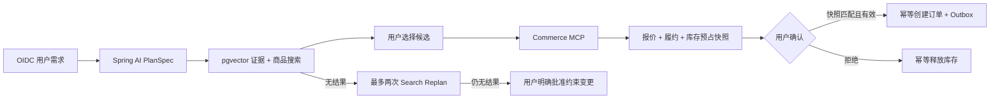

# BuyForU

BuyForU 是一个以真实交易约束为边界的电商购物 Agent。Agent 负责理解需求、受限规划、检索和推荐；金额、优惠、履约、库存预占与订单创建只由 Commerce Domain 决定。

项目的完整需求边界、架构、一致性、高并发设计和面试问答见 [项目设计与面试指南](docs/PROJECT_DESIGN.md)。第一次阅读代码也可以先看 [中文代码结构导览](docs/CODE_GUIDE.md)；需要逐文件查找职责时看 [文件职责索引](docs/FILE_INDEX.md)。

## 当前实现

- Spring AI 通过 OpenAI 兼容协议调用真实 DeepSeek Chat API，输出结构化 `PlanSpec`；没有确定性模型降级。
- LangGraph4j 固定图实际执行规划、搜索、候选选择、预占、人工审批、下单和约束放宽，checkpoint 持久化到 PostgreSQL。
- Agent 与 Commerce 只通过带服务凭证的 Streamable HTTP MCP 通信；业务层仅依赖 `CommerceGateway`。
- Commerce 使用 PostgreSQL 行锁、事务和 effect ledger 防超卖与重复副作用，订单与 outbox 在同一事务落库。
- 促销门槛、优惠金额与运费规则存于 Commerce 数据表；Agent 和前端不计算交易金额。
- 报价与快照版本由 PostgreSQL sequence 生成；过期预占由定时事务回收，不依赖下一次用户请求。
- `ConfirmableOrderSnapshot` 在用户最终确认前锁定报价、履约承诺和库存；审批必须匹配用户、快照、摘要及有效期。
- 本地 Ollama `embeddinggemma` 生成真实向量，pgvector 保存带来源、版本和模型名的知识 chunks；没有关键词检索降级。
- Web 使用 OIDC Authorization Code + PKCE。API 从 JWT `sub` 获取用户，并校验 issuer 与 audience；不接受客户端自报用户 ID。
- 页面刷新后会按 JWT 用户恢复已有配送地址和最近任务；待选择和待审批状态可继续处理。
- 生产 JAR 不包含任何 InMemory Commerce/Agent Store。内存实现仅存在于 test-jar。
- Actuator 提供健康探针和 Prometheus 指标；API 错误与响应头包含请求关联编号。
- Redis Lua Token Bucket 在所有 Agent 实例间统一限流；用户级虚拟时间队列保证高频用户不能垄断执行槽。
- 写 API 使用 `202 Accepted` 持久化命令；Worker 用 30 秒短租约和 execution epoch 推进固定图，LLM/MCP 等待期间不持有数据库连接。
- DeepSeek、MCP 读、MCP 写和 Ollama 分别使用虚拟线程执行器、零等待 Bulkhead、硬超时与独立熔断器。
- 运行事件先写 PostgreSQL，再由 Redis Pub/Sub 唤醒 SSE；浏览器断线后可回放或轮询恢复。

## 模块与流程

```text
commerce-port     交易端口和领域模型，不依赖 MCP
commerce-service  PostgreSQL 交易事实源和 MCP Server（8081）
agent-app         异步命令、公平调度、Spring AI、LangGraph4j、MCP、JWT API（8080）
web               React + TypeScript + OIDC PKCE（5173）
infra/keycloak    本地 realm/client 配置，不预置用户密码
```



## 本地启动

要求 JDK 21、Node.js 20+、Docker Desktop，以及可用的 DeepSeek API Key。先复制配置模板；不要提交生成的 `.env`。

```bash
cp .env.example .env
cp web/.env.example web/.env
```

编辑根目录 `.env`，至少设置三个必填值。`COMMERCE_MCP_SERVICE_TOKEN` 使用随机 32 字节以上内容。

```dotenv
DEEPSEEK_API_KEY=...
KEYCLOAK_ADMIN_USERNAME=...
KEYCLOAK_ADMIN_PASSWORD=...
COMMERCE_MCP_SERVICE_TOKEN=...
```

`DEEPSEEK_API_KEY` 为空时 Agent 会在启动阶段明确失败，不存在本地规则模型或空结果降级。`production` profile 还必须设置 `EVENT_WEBHOOK_URL` 和至少 32 字符的 `EVENT_SIGNING_SECRET`；订单 Outbox 会用 HMAC-SHA256 签名并重试投递。本地非 production profile 使用显式的本地事件 sink。

启动 PostgreSQL/pgvector、Redis、Keycloak 和 Ollama，并拉取固定 embedding 模型：

```bash
docker compose --env-file .env up -d
docker compose ps
```

在 IDEA 中建立两个 Spring Boot 配置并都加载根目录 `.env`：

- `com.buyforu.commerce.CommerceServiceApplication`
- `com.buyforu.agent.BuyForUAgentApplication`

也可分别用命令启动：

```bash
set -a; source .env; set +a
# 必须先 install。只跑 -pl agent-app 会加载 ~/.m2 里过期的 commerce-port，
# SearchRequest 增减字段后会变成 NoSuchMethodError。
./mvnw -pl commerce-port,commerce-service,agent-app -am install -DskipTests
./mvnw -pl commerce-service spring-boot:run
./mvnw -pl agent-app spring-boot:run
```

前端：

```bash
cd web
npm install
npm run dev
```

访问 `http://localhost:5173`，点「安全登录」。登录页可以自己注册账号（本地关闭了邮箱验证）。登记配送区域后提交自然语言购物需求。Agent 若缺少品类等信息会暂停询问；选中 SKU 后 Commerce 才会预占库存；最终点击确认才创建订单。身份仍由 Keycloak 签发 JWT，业务库不存密码。

## 真实 API 链路

所有 `/api/**` 请求都要求 `Authorization: Bearer <JWT>`。

1. `POST /api/v1/addresses`：幂等登记已登录用户的配送区域，返回 `addressId`。
2. `GET /api/v1/addresses`：读取当前用户已有配送地址。
3. `POST /api/v1/runs`：携带 `Idempotency-Key`，返回 `202`、`commandId` 和 `runId`。
4. `GET /api/v1/runs`：读取当前用户最近任务，用于刷新和重启恢复。
5. `POST /api/v1/runs/{id}/clarifications`：补充缺失条件。
6. `POST /api/v1/runs/{id}/selection`：选择 SKU，事务性报价与库存预占。
7. `POST /api/v1/runs/{id}/approvals`：批准或拒绝当前快照。
8. `POST /api/v1/runs/{id}/constraint-relaxations`：用户明确说明允许修改的硬条件；只能改变文字明确点名的字段。
9. `POST /api/v1/runs/{id}/cancellations`：在任一人工等待点取消任务；已预占库存会幂等释放。
10. `GET /api/v1/runs/{id}`：读取持久化运行状态。
11. `GET /api/v1/commands/{commandId}`：读取 QUEUED、RUNNING、RETRY_WAIT 或终态。
12. `GET /api/v1/runs/{id}/events`：带 JWT 的可断线续传 SSE；Web 使用 fetch 流而非 URL Token。

除 GET 外的 Agent run 写接口都要求 `Idempotency-Key` 请求头并返回 `202`。Redis 不可用时，新规划和交易命令返回 503；查询及取消仍走 PostgreSQL 控制路径。命令事实、租约、栅栏和 SSE 回放都在 PostgreSQL 中，Redis 数据丢失后会由后台任务重建。

知识管理员先由 Keycloak 管理员显式授予 realm role `knowledge-admin`，再调用 `POST /internal/v1/knowledge/documents` 写入带来源、版本和正文的知识文档；更新已有文档时必须提供当前 `expectedVersion`，以防并发覆盖。服务会真实生成 embedding 并存入 pgvector，并记录操作者、来源和正文摘要。普通 SPA 用户不能自行申请该角色。

## 验证

```bash
./mvnw clean package
cd web && npm run build
```

一键验收（单测；有 Docker 再跑集成测试；然后前端 typecheck/build）：

```bash
chmod +x scripts/accept.sh
./scripts/accept.sh
```

集成测试单独跑：`./mvnw -Pintegration verify`。默认 `./mvnw test` 不起容器。

压测脚本在 `scripts/k6/`，需要本机已起服务并准备好 JWT，不进 CI 必过路径。

测试覆盖固定图真实节点与两次人工恢复、完整选择/预占/审批/下单、订单副作用后的崩溃恢复、库存并发不超卖、effect 冲突、用户隔离、结构化计划安全校验和 pgvector chunk 边界。完整外部验收还要求 Docker 服务正常且 DeepSeek Key 可调用。

本地采用 PostgreSQL 而不是 MySQL，是因为本项目同时依赖关系事务、行锁、advisory lock、JSONB 和 pgvector；将交易状态、LangGraph checkpoint 与向量知识放在同一个可事务运维的数据平台，能减少当前规模下不必要的中间件。若未来交易主库必须接入既有 MySQL，`CommerceGateway` 边界允许替换 Commerce 持久化，而 Agent 的 pgvector/checkpoint 仍可独立保留在 PostgreSQL。
