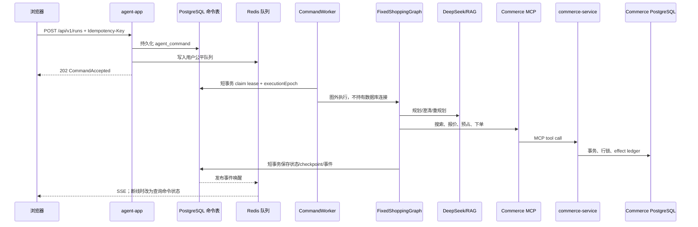

# BuyForU 代码逻辑学习文档

> 本文面向需要读懂、运行、调试和继续开发 BuyForU 的工程师。内容以当前仓库代码为准，不把架构计划当成已经实现的功能。
>
> 已有文档的分工：
> - [`CODE_GUIDE.md`](./CODE_GUIDE.md)：快速结构导览。
> - [`FILE_INDEX.md`](./FILE_INDEX.md)：文件级职责索引。
> - [`PROJECT_DESIGN.md`](./PROJECT_DESIGN.md)：总体设计和面试视角。
> - [`CORRECTNESS_REVIEW_FIXES.md`](./CORRECTNESS_REVIEW_FIXES.md)：历史需求、Review 结论和已做修复记录。
>
> 本文更像“源码教材”：解释代码为什么这样调用、状态如何变化、数据库和外部系统的边界在哪里，以及出现问题时应该从哪里开始排查。

---

## 1. 先建立整体心智模型

BuyForU 不是“让 LLM 直接调用下单 API”，而是四个边界清晰的系统组合：

| 模块 | 代码位置 | 负责什么 | 明确不负责什么 |
| --- | --- | --- | --- |
| 共享交易端口 | `commerce-port` | `CommerceGateway` 和交易领域 DTO | 不连数据库、不调用 MCP |
| 交易服务 | `commerce-service` | 商品、价格、优惠、库存、报价、预占、订单事实 | 不理解自然语言、不决定用户意图 |
| Agent 服务 | `agent-app` | 认证、命令接入、记忆、RAG、DeepSeek 规划、固定图、人工确认 | 不计算最终价格、不直接改库存 |
| Web | `web` | OIDC 登录、任务交互、SSE/轮询、展示快照 | 不保存 DeepSeek Key、不决定交易结果 |

本地编排文件 [`docker-compose.yml`](../docker-compose.yml) 只负责基础设施：PostgreSQL/pgvector、Redis、Keycloak、Ollama 和初始化容器；Java 服务和 Vite Web 通常由 IDE 或命令行单独启动。

### 1.1 一次请求的完整调用链



关键原则是：

1. **PostgreSQL 是事实来源**：命令、Agent 状态、事件、交易结果最终都以数据库为准。
2. **Redis 是协调索引**：用于限流、公平调度和事件唤醒；丢失后可以由数据库重新建索引。
3. **LLM 和 MCP 不在数据库事务内执行**：避免网络等待占满 Hikari 连接池。
4. **LLM 只产出结构化计划**：不能改变 LangGraph 拓扑，也不能成为金额、库存和订单的事实源。
5. **副作用先记账再调用**：`effectId` 让超时、崩溃和重试不会产生第二份预占或订单。

---

## 2. 如何开始阅读和运行

### 2.1 推荐阅读顺序

建议按以下顺序阅读，而不是从 Controller 逐文件跳转：

1. [`commerce-port/.../CommerceGateway.java`](../commerce-port/src/main/java/com/buyforu/commerce/port/CommerceGateway.java)：先看 Agent 可以请求哪些交易能力。
2. [`commerce-port/.../CommerceModels.java`](../commerce-port/src/main/java/com/buyforu/commerce/port/model/CommerceModels.java)：理解金额、报价、预占、快照、审批证明和 effect。
3. [`agent-app/.../PlanSpec.java`](../agent-app/src/main/java/com/buyforu/agent/domain/PlanSpec.java)：理解 LLM 允许表达的计划。
4. [`agent-app/.../ShoppingAgentState.java`](../agent-app/src/main/java/com/buyforu/agent/domain/ShoppingAgentState.java)：理解业务状态。
5. [`agent-app/.../FixedShoppingGraph.java`](../agent-app/src/main/java/com/buyforu/agent/application/FixedShoppingGraph.java)：理解固定图的节点和路由。
6. [`agent-app/.../GraphShoppingWorkflow.java`](../agent-app/src/main/java/com/buyforu/agent/application/GraphShoppingWorkflow.java)：理解命令如何启动、恢复和等待人工输入。
7. [`agent-app/.../ShoppingWorkflowService.java`](../agent-app/src/main/java/com/buyforu/agent/application/ShoppingWorkflowService.java)：理解每个图节点真正做什么。
8. [`commerce-service/.../JdbcCommerceEngine.java`](../commerce-service/src/main/java/com/buyforu/commerce/application/JdbcCommerceEngine.java)：理解交易事务和库存一致性。
9. MCP、持久化、命令并发和 [`web/src/App.tsx`](../web/src/App.tsx)：补齐运行时和用户体验。

### 2.2 启动时要知道的端口

| 组件 | 默认端口 | 作用 |
| --- | ---: | --- |
| agent-app | 8080 | 用户 API、命令、运行状态和 SSE |
| commerce-service | 8081 | MCP 交易工具 |
| Web | 5173 | React/Vite 页面 |
| PostgreSQL | 5432 | agent_schema、commerce_schema、pgvector |
| Redis | 6379 | 限流、公平队列和实时通知 |
| Keycloak | 8082 | 本地 OIDC 身份提供方 |
| Ollama | 11434 | Embedding 模型服务 |

运行环境变量由 [`application.yml`](../agent-app/src/main/resources/application.yml)、[`application.yml`](../commerce-service/src/main/resources/application.yml)、`.env.example` 和 Docker Compose 共同决定。DeepSeek Key 只应放在本地环境变量或 IDE Run Configuration，不要写入 Java、前端、Dockerfile 或文档。

---

## 3. HTTP 入口：请求如何变成可恢复命令

### 3.1 `AgentRunController` 只做协议边界

文件：[`AgentRunController.java`](../agent-app/src/main/java/com/buyforu/agent/api/AgentRunController.java)

Controller 的职责有四个：

1. 从已验证 JWT 的 `sub` 得到 `userId`，不接受客户端自报身份。
2. 用 Jakarta Validation 限制字符串长度、金额范围、数量和列表大小。
3. 把 HTTP DTO 转换成领域对象，例如 `BudgetInput -> Money`、`ConstraintInput -> ShoppingConstraints`。
4. 把写请求交给 `CommandService.accept`，统一返回 `202 Accepted`。

它不直接调用 DeepSeek 或 `ShoppingWorkflowService`。这样做的原因是写请求可能排队、重试或在另一台实例执行，HTTP 线程不能承担整条图的生命周期。

主要接口：

| 接口 | 命令类型 | 队列 | 用户动作 |
| --- | --- | --- | --- |
| `POST /api/v1/runs` | `START` | `PLANNING` | 创建购物任务 |
| `POST /runs/{id}/clarifications` | `CLARIFY` | `PLANNING` | 补充信息 |
| `POST /runs/{id}/constraint-relaxations` | `RELAX` | `PLANNING` | 明确批准放宽条件 |
| `POST /runs/{id}/selection` | `SELECT` | `TRANSACTION` | 选择 SKU |
| `POST /runs/{id}/approvals` | `APPROVE` | `TRANSACTION` | 使用当前快照下单 |
| `POST /runs/{id}/approvals` | `REJECT` | `CONTROL` | 拒绝并释放预占 |
| `POST /runs/{id}/cancellations` | `CANCEL` | `CONTROL` | 取消任务 |
| `GET /runs/{id}` | — | 查询 | 读取业务状态 |
| `GET /commands/{id}` | — | 查询 | 读取命令状态 |
| `GET /runs/{id}/events` | — | SSE | 读取进度事件 |

`START` 的 `runId` 根据 `userId + Idempotency-Key` 确定性生成，因此客户端超时重试时仍指向同一业务任务。

### 3.2 `CommandService` 的接纳顺序

文件：[`CommandService.java`](../agent-app/src/main/java/com/buyforu/agent/concurrency/CommandService.java)

接纳命令时按以下顺序工作：

1. 校验幂等键存在且长度合法。
2. 非 `START` 命令查询 run 并校验所属用户。
3. 对 `commandType + runId + payload` 计算 SHA-256 `requestHash`。
4. 查询 `(userId, runId, idempotencyKey)`：
   - 同一 hash：返回原命令，安全重放。
   - 不同 hash：返回冲突，防止同一键代表两个动作。
5. 按命令类型执行 Redis 入口限流。
6. 计算 `deadlineAt`：规划、交易、控制使用不同期限。
7. 在 PostgreSQL 插入 `agent_command`。
8. 规划/交易命令写 Redis 公平队列；控制命令保留在 PostgreSQL 控制路径。
9. 写入 `command.accepted` 事件并返回 `CommandAccepted`。

数据库提交成功而 Redis 入队前进程崩溃时，维护线程会扫描 `QUEUED` 命令重新建索引；因此 Redis 不是命令事实源。

### 3.3 查询、错误和权限

[`CommandController.java`](../agent-app/src/main/java/com/buyforu/agent/api/CommandController.java) 只返回状态、尝试次数、错误码和时间字段，不返回 payload、请求哈希或幂等键。

[`ApiExceptionHandler.java`](../agent-app/src/main/java/com/buyforu/agent/api/ApiExceptionHandler.java) 把领域冲突、限流、Redis 不可用、MCP 契约错误和未知异常映射为统一 Problem Details。MCP 原始 schema 和服务端 token 不应穿透到浏览器。

---

## 4. 领域模型：计划、业务状态和交易对象

### 4.1 `PlanSpec`：LLM 的能力边界

文件：[`PlanSpec.java`](../agent-app/src/main/java/com/buyforu/agent/domain/PlanSpec.java)

`PlanSpec` 是 LLM 的结构化输出，不是订单。它包含：

- `intentType`：当前只支持产品发现类意图。
- `normalizedConstraints`：搜索词、品类、预算上下限、品牌、规格、数量、地址和送达时间。
- `clarification`：是否缺信息、缺哪些字段、要问用户什么。
- `searchStrategy`：关键字/属性/混合搜索策略。
- `readTasks`：允许的只读任务，如搜索、报价、库存履约和政策查询。
- `rankingPreferences`：价格、配送、品牌、规格匹配的排序偏好。
- `fallbackPolicy`：候选回退、最多搜索重试次数、是否必须人工批准。
- `rationale`：解释信息，不能替代交易事实。

LLM 可以修改“怎么找”，不能创建任意工具图，也不能返回最终价格和库存结论。

### 4.2 `PlanSpecValidator`：模型输出的第二道防线

文件：[`PlanSpecValidator.java`](../agent-app/src/main/java/com/buyforu/agent/domain/PlanSpecValidator.java)

验证器在模型调用之后执行，主要规则如下：

1. 读任务不超过 4 个，列表和 map 的大小有限制。
2. 不能有重复读任务或重复排序偏好。
3. 非澄清计划必须包含 `SEARCH_PRODUCTS`。
4. 搜索重试范围为 0 到 2，且约束放宽必须要求人工批准。
5. `budgetMin <= budgetMax`；可执行数量在 1 到 99。
6. 首次计划缺少品类或地址时只能进入澄清，不能偷偷猜测。
7. 偏好品牌和排除品牌不能冲突。
8. 澄清字段只能来自允许列表，问题文本不能为空。

因此，模型输出必须经过“结构化解析 + 领域校验”才能进入固定图。

### 4.3 `ShoppingAgentState`：页面看到的业务状态

文件：[`ShoppingAgentState.java`](../agent-app/src/main/java/com/buyforu/agent/domain/ShoppingAgentState.java)

关键字段：

| 字段 | 作用 |
| --- | --- |
| `runId`/`userId` | 任务身份和数据隔离 |
| `planSpec` | 当前计划及其约束版本 |
| `phase` | 当前业务阶段 |
| `candidateSet` | 当前已由 Commerce 搜索并过滤的候选 |
| `selectedCandidateIndex` | 用户选择的候选位置 |
| `confirmableSnapshot` | 当前报价、运费、履约、库存预占和过期时间 |
| `pendingApproval` | snapshotId、摘要 hash 和审批有效期 |
| `activeEffect` | 当前外部副作用的 effectId、操作、请求 hash、状态 |
| `candidateFallbackCount`/`searchReplanCount` | 回退预算，防止无限循环 |
| `planVersion` | 约束或搜索计划变化时递增 |
| `finalOrder` | 完成后的订单事实 |

`ShoppingAgentState` 和 LangGraph checkpoint 不同：前者说明业务结果，后者说明图执行位置。二者都持久化，恢复时必须交叉判断。

### 4.4 交易端口模型

文件：[`CommerceModels.java`](../commerce-port/src/main/java/com/buyforu/commerce/port/model/CommerceModels.java)

重要对象关系：

```text
SearchRequest -> SearchResult -> ProductCandidate
ProductCandidate + constraints -> Quote
Quote + Reservation -> ConfirmableOrderSnapshot
ConfirmableOrderSnapshot + ApprovalProof -> CreateOrderCommand -> Order
```

- `Money` 强制 CNY、非负金额，最多两位小数。
- `Quote.payableAmount` 是商品金额减优惠加运费后的最终应付。
- `Reservation` 有 `ACTIVE/CONSUMED/RELEASED/EXPIRED` 生命周期。
- `ConfirmableOrderSnapshot.summaryHash` 把用户、SKU、金额、履约、预占和有效期绑定起来。
- `ApprovalProof` 必须匹配当前 snapshotId、summaryHash、审批人和有效期。
- `EffectContext` 把逻辑副作用与 `runId/nodeId/attempt/userId/traceId` 绑定。

Agent 不应自行 new 一个“更便宜的 Quote”或修改快照中的金额。

---

## 5. 固定 LangGraph：节点做什么、为什么固定

文件：[`FixedShoppingGraph.java`](../agent-app/src/main/java/com/buyforu/agent/application/FixedShoppingGraph.java)

图的拓扑在 Java 代码中固定；模型只生成 `PlanSpec` 数据。这样能防止提示词注入让模型新增下单节点、跳过审批或绕过库存检查。

### 5.1 节点和路由

| 节点 | 主要调用 | 成功后的阶段 |
| --- | --- | --- |
| `planSpec` | 创建或恢复计划 | `SEARCHING` 或 `NEEDS_CLARIFICATION` |
| `needClarification` | 暂停等待用户回答 | `NEEDS_CLARIFICATION` |
| `applyClarification` | 追加消息并重新规划 | `SEARCHING` 或继续澄清 |
| `searchAndRank` | Commerce 搜索、硬过滤、排序 | `PRESENTING_CANDIDATES` |
| `presentCandidates` | 暂停等待用户选 SKU | `PRESENTING_CANDIDATES` |
| `recordSelection` | 校验 SKU 属于当前候选集 | `PREPARING_CONFIRMABLE_ORDER` |
| `prepareConfirmableOrder` | 重新报价、预占库存、生成快照 | `WAITING_APPROVAL` |
| `awaitApproval` | 暂停等待批准或拒绝 | `WAITING_APPROVAL` |
| `createOrder` | 校验审批证明并幂等下单 | `COMPLETED` |
| `constraintRelaxation` | 暂停等待用户授权放宽 | `NEEDS_CONSTRAINT_RELAXATION` |
| `applyConstraintRelaxation` | 只修改点名字段并递增版本 | `SEARCHING` |
| `cancel` | 释放预占并结束任务 | `CANCELLED` |

固定转移关系：

```text
NEW -> NEEDS_CLARIFICATION / SEARCHING
NEEDS_CLARIFICATION -> SEARCHING / CANCELLED
SEARCHING -> PRESENTING_CANDIDATES / NEEDS_CONSTRAINT_RELAXATION / FAILED
PRESENTING_CANDIDATES -> PREPARING_CONFIRMABLE_ORDER / CANCELLED
PREPARING_CONFIRMABLE_ORDER -> WAITING_APPROVAL / SEARCHING / NEEDS_CONSTRAINT_RELAXATION / FAILED
WAITING_APPROVAL -> CREATING_ORDER / PREPARING_CONFIRMABLE_ORDER / CANCELLED
CREATING_ORDER -> COMPLETED / PREPARING_CONFIRMABLE_ORDER / FAILED
NEEDS_CONSTRAINT_RELAXATION -> SEARCHING / CANCELLED
```

澄清、候选展示、审批和约束放宽是人工节点，图在这些节点后 interrupt。前端只能提交对应命令，不能提交任意目标 phase。

### 5.2 图状态和路由字段

图通过 `phaseRoute`、`clarificationRoute`、`searchRoute`、`selectionRoute`、`prepareRoute`、`approvalRoute`、`relaxationRoute` 和 `orderRoute` 表达下一跳。路由字段是内部控制数据，不是用户输入。

`GraphShoppingWorkflow` 在启动、澄清、选择、批准、拒绝、放宽和取消时加载业务状态，再按照当前 checkpoint 和 phase 决定是继续、重放还是返回人工等待。

### 5.3 恢复逻辑

文件：[`GraphShoppingWorkflow.java`](../agent-app/src/main/java/com/buyforu/agent/application/GraphShoppingWorkflow.java)

恢复不能简单地“从最后一个节点裸跑”：

- 最后一个节点是人工等待节点时，必须等待新的用户命令。
- `PREPARING_CONFIRMABLE_ORDER` 可能已经写入 PENDING effect；恢复时应使用同一 effectId 重放。
- 报价过期时先释放旧预占，再递增 `planVersion`，生成新 effectId 并重新报价。
- `CREATING_ORDER` 处于不确定窗口时，优先按 snapshot 查询是否已存在订单；不能仅因为 Worker 超时就再次创建订单。

---

## 6. `ShoppingWorkflowService`：业务链路逐步拆解

文件：[`ShoppingWorkflowService.java`](../agent-app/src/main/java/com/buyforu/agent/application/ShoppingWorkflowService.java)

### 6.1 开始任务和规划

`start` 先调用 `planNewRun`，如果计划可执行再调用搜索；如果缺字段则停在澄清。

`planNewRun` 的顺序：

1. 按 `runId` 查询已有状态并校验用户、会话和原始请求。
2. 没有状态时先保存 `NEW` 占位，让页面能看到任务已创建。
3. 从 `ConversationMemory` 读取最近消息，拼成上下文。
4. 通过 `PlanningModel.createPlan` 调 DeepSeek。
5. 用 `PlanSpecValidator` 校验结构化结果。
6. 保存 `NEEDS_CLARIFICATION` 或 `SEARCHING`，并将 `planVersion` 设为 1。

如果进程在模型调用后、checkpoint 写入前崩溃，下一次相同命令会根据已持久化状态判断是否需要继续规划，避免无限追加会话消息。

### 6.2 澄清和约束放宽

`clarify` 只允许在 `NEEDS_CLARIFICATION` 阶段使用：追加用户消息，以当前约束为基础重新规划并递增版本。

`applyConstraintRelaxation` 只允许在 `NEEDS_CONSTRAINT_RELAXATION` 阶段使用：

1. 用户必须提交字段白名单。
2. 模型可以重写被批准字段，但不能改变认证地址。
3. 新约束版本必须正好是旧版本加一。
4. 放宽后清空候选和旧快照，重新进入搜索。

例如用户说“预算可以提高”，并不自动授权修改预算；只有 UI 勾选 `budgetMax` 并提交命令才会进入此用例。

### 6.3 搜索和排序

`executeSearch` 把硬约束传给 `CommerceGateway.searchProducts`，Commerce 再按真实库存、价格和履约过滤。Agent 只对已过滤结果做展示排序：

- `PRICE`：有预算上限时优先低价；只有预算下限时优先高价。
- `DELIVERY`：优先早送达。
- `BRAND_PREFERENCE`：按用户偏好品牌顺序。
- `SPEC_MATCH`：使用 [`CatalogAttributeNormalizer`](../commerce-port/src/main/java/com/buyforu/commerce/port/CatalogAttributeNormalizer.java) 统一属性键后计算匹配数。

排序不能把硬过滤重新放宽，也不能把缺货商品变成有货商品。

### 6.4 三级 Replan

文件：[`ReplanController.java`](../agent-app/src/main/java/com/buyforu/agent/domain/ReplanController.java)

当搜索为空或预占失败时，严格按三层处理：

1. **Candidate fallback**：当前候选集还有下一个已验证 SKU，就换下一个，保持原约束。
2. **Search replan**：候选全部失效且次数未超上限时，允许模型重写搜索表达，但硬约束不变。
3. **Constraint relaxation**：仍无结果时进入人工等待，要求用户明确批准要改的字段。

缺货/SKU 下架可以触发前两层；预算不足不能自动抬预算，只能换候选或请求用户放宽。

### 6.5 选择、预占和确认快照

用户选择 SKU 后，服务先检查该 SKU 仍在当前候选集，再保存 `PREPARING_CONFIRMABLE_ORDER` 和 PENDING effect，然后调用 Commerce：

1. Commerce 重新计算报价。
2. 检查最终应付金额的上下限。
3. 锁定库存行并创建 ACTIVE reservation。
4. 创建带 `summaryHash` 和过期时间的 `ConfirmableOrderSnapshot`。
5. Agent 保存 `WAITING_APPROVAL`、快照和审批请求。

这一步是“把搜索结果变成可确认交易”的边界。搜索时看到的价格不等于确认时的价格。

### 6.6 审批和下单

批准请求必须携带当前 `snapshotId + expectedSummaryHash`。服务验证：

- run 当前正在等待审批或从创建订单恢复；
- snapshot 与 hash 完全相同；
- 快照和预占未过期；
- 审批人就是当前 JWT 用户。

服务先保存 `CREATING_ORDER + PENDING_EFFECT`，再调用 Commerce `createOrder`。Commerce 再次锁定快照和 reservation，验证审批证明，并在同一事务中消费预占、写订单和写 Outbox。成功后 Agent 保存 `COMPLETED + EFFECT_APPLIED`。

### 6.7 取消语义

- `WAITING_APPROVAL`：释放 ACTIVE reservation，再标记 `CANCELLED`。
- `PREPARING_CONFIRMABLE_ORDER`：如果预占请求可能已成功，只按原 effectId 重放，不重新规划、不重新调用 DeepSeek；缺货/预算失败视为没有可释放预占。
- `CREATING_ORDER`：先确认没有其他活租约，再按 snapshot 查询订单；查到订单则恢复 `COMPLETED`，查不到才幂等释放 reservation 并再次查询。
- `COMPLETED`：购物工作流不能静默取消已创建订单，返回领域冲突。

取消不是“把 phase 改成 CANCELLED”这么简单，它必须先解决外部交易副作用的结果未知问题。

---

## 7. 规划模型、记忆和 RAG

### 7.1 `PlanningModel` 抽象

接口：[`PlanningModel.java`](../agent-app/src/main/java/com/buyforu/agent/application/PlanningModel.java)

应用服务只依赖以下能力：创建初始计划、根据澄清重新规划、在搜索失败时 replan、应用用户批准的约束放宽。这样测试可以使用确定性模型，生产才使用 DeepSeek。

### 7.2 `SpringAiPlanningModel`

文件：[`SpringAiPlanningModel.java`](../agent-app/src/main/java/com/buyforu/agent/application/SpringAiPlanningModel.java)

模型调用的保护逻辑：

1. 系统提示词声明“不能编造价格、库存、配送结果”。
2. 只允许返回 `PlanSpec` 字段和有限 read task。
3. RAG 材料标记为不可信参考，不能覆盖交易事实。
4. `DependencyExecutor.DEEPSEEK` 提供独立虚拟线程、Bulkhead、超时、重试和熔断。
5. 解析后补齐类别、预算方向和显式约束；不能把模型猜测当成用户要求。
6. `replan` 保留硬约束，只能改变搜索表达和策略。

### 7.3 对话记忆

接口和实现：[`ConversationMemory.java`](../agent-app/src/main/java/com/buyforu/agent/application/ConversationMemory.java)、[`JdbcConversationMemory.java`](../agent-app/src/main/java/com/buyforu/agent/infrastructure/persistence/JdbcConversationMemory.java)

记忆保存用户消息和时间顺序。它服务于上下文理解，不是交易事实源；地址、库存、金额仍必须通过认证和 Commerce 查询获得。

### 7.4 pgvector 知识库

实现：[`PgVectorKnowledgeStore.java`](../agent-app/src/main/java/com/buyforu/agent/infrastructure/knowledge/PgVectorKnowledgeStore.java)

写入流程：

1. 校验 actor、文档版本和内容长度。
2. 按 chunk 切分文档。
3. 在事务外调用 Ollama Embedding，避免占用数据库连接。
4. 短事务保存文档、chunk、向量和审计信息。

检索流程：

1. 在事务外生成查询向量。
2. 用 pgvector 相似度 SQL 找候选 chunk。
3. 将材料交给规划模型作为参考证据。

知识检索是增强信息而不是硬依赖；检索失败会记录日志并返回空证据，但 Commerce 搜索、报价和库存不能用知识库结果替代。

---

## 8. 并发治理：命令、Redis、公平队列和租约

### 8.1 为什么写请求异步化

DeepSeek 可能等待几十秒，MCP 可能遇到限流或网络抖动。同步 HTTP 会占住连接、难以重试，也不能让页面可靠恢复。因此写接口只接纳命令，实际执行由 `CommandWorker` 完成。

### 8.2 Redis Token Bucket

实现：[`RedisAdmissionController.java`](../agent-app/src/main/java/com/buyforu/agent/concurrency/RedisAdmissionController.java)

Lua 脚本在 Redis 内原子完成“补令牌、判断、扣减”：

- 规划：用户 6 次/分钟，突发 2。
- 交易：用户 30 次/分钟，突发 10。
- 控制：取消/拒绝独立限流，且 PostgreSQL 控制路径可用。
- 写 IP 和全局桶用于粗粒度保护。
- 查询限流在 Redis 故障时 best effort；新规划/交易命令 fail-closed。

### 8.3 Redis 用户公平队列

实现：[`RedisFairQueue.java`](../agent-app/src/main/java/com/buyforu/agent/concurrency/RedisFairQueue.java)

每个 lane 使用：

- 用户 LIST：保证单用户 FIFO。
- `active-users` ZSET：score 是虚拟完成时间。
- `indexed` SET：避免重复入队。
- `depth` 和 `virtual-time`：控制容量和新用户起点。

Lua dequeue 每次从 score 最小的用户取一条，再把该用户 score 加一；所以一个用户排 100 条不会连续占满执行槽。每个用户还有一个带 TTL 的 running permit，保证同一用户同时最多执行一条命令。

### 8.4 `CommandWorker` 的生命周期

文件：[`CommandWorker.java`](../agent-app/src/main/java/com/buyforu/agent/concurrency/CommandWorker.java)

工作线程分为 planning、transaction、control 三类虚拟线程池。每次执行：

1. 从控制表或 Redis 队列取 commandId。
2. 获取用户 permit。
3. `RunLeaseRepository.claim` 在短事务内锁定 `agent_run_execution`，递增 `executionEpoch`，写入 active command 和租约。
4. 提交事务，连接归还池中。
5. 在事务外执行 LangGraph、DeepSeek、Embedding 和 MCP。
6. 状态保存、checkpoint、命令终态和事件各自使用短事务。
7. 释放租约和用户 permit。

### 8.5 Lease、epoch 和 fencing

实现：[`RunLeaseRepository.java`](../agent-app/src/main/java/com/buyforu/agent/concurrency/RunLeaseRepository.java)、[`ExecutionContext.java`](../agent-app/src/main/java/com/buyforu/agent/concurrency/ExecutionContext.java)

`leaseUntil` 解决 Worker 崩溃后的接管；`executionEpoch` 解决旧 Worker 在暂停后恢复的问题。状态和 checkpoint 写入必须同时验证：

```text
runId + activeCommandId + executionEpoch + expectedStateVersion
```

[`JdbcAgentRunStore.java`](../agent-app/src/main/java/com/buyforu/agent/infrastructure/persistence/JdbcAgentRunStore.java) 用乐观版本和当前 lease 条件更新 `agent_run`；[`PostgresCheckpointSaver.java`](../agent-app/src/main/java/com/buyforu/agent/infrastructure/persistence/PostgresCheckpointSaver.java) 对 checkpoint 做 epoch 校验。

### 8.6 网络依赖执行器

实现：[`DependencyExecutor.java`](../agent-app/src/main/java/com/buyforu/agent/concurrency/DependencyExecutor.java)

DeepSeek、MCP Read、MCP Write 和 Embedding 各自有独立虚拟线程执行器、Semaphore Bulkhead、CircuitBreaker 和 deadline。调用前由 [`NetworkCallGuard.java`](../agent-app/src/main/java/com/buyforu/agent/concurrency/NetworkCallGuard.java) 断言当前没有数据库事务。

超时使用命令剩余期限，而不是每个下游重新开始完整预算；MCP Write 超时是“结果未知”，必须复用同一 effectId，而不能直接当成失败再创建一次。

---

## 9. 持久化、checkpoint、effect 和事件

### 9.1 Agent 数据库

迁移位于 [`agent-app/src/main/resources/db/migration`](../agent-app/src/main/resources/db/migration)：

| 迁移 | 逻辑 |
| --- | --- |
| V1 | run、conversation、message 等核心表 |
| V2 | LangGraph checkpoint |
| V3 | Embedding 模型和向量基础结构 |
| V4 | 审批审计 |
| V5 | 知识库审计 |
| V6 | execution lease、epoch、事件和并发字段 |
| V7 | command、幂等键和所有权约束 |
| V8 | 查询索引 |

迁移必须只追加，不修改已执行脚本；表结构调整要创建新的 `Vn__...sql`。

### 9.2 三种恢复记录

1. **业务状态**：`agent_run.state`，页面读取它。
2. **LangGraph checkpoint**：保存图状态和当前节点。
3. **副作用记录**：Agent 的 active effect 和 Commerce 的 effect ledger。

典型崩溃窗口：

```text
保存 PENDING_EFFECT -> 调用 Commerce 成功 -> Agent 保存 APPLIED
```

如果进程死在中间，恢复逻辑用原 effectId 重放或查询事实；不能生成新 effectId。

### 9.3 Commerce 事务事实源

实现：[`JdbcCommerceEngine.java`](../commerce-service/src/main/java/com/buyforu/commerce/application/JdbcCommerceEngine.java)

#### 搜索和报价

搜索按属性归一化、品牌排除、预算范围、库存和送达时间过滤；报价由商品金额、优惠和运费组成。

#### 预占

`prepareConfirmableOrder` 在一个事务中：

1. 验证地址和 SKU。
2. 锁库存行。
3. 处理旧 reservation 过期。
4. 重新计算报价并校验预算上下限。
5. 扣减可售数量、增加预占数量。
6. 插入 reservation 和 snapshot。
7. 记录 effect ledger。

#### 下单

`createOrder` 锁定 snapshot/reservation，验证审批 proof 和有效期，消费 ACTIVE reservation，插入订单并写 outbox。订单与领域事件同一事务提交。

#### 释放和过期

释放只对 ACTIVE reservation 加回库存，重复释放是幂等的。[`ReservationExpiryJob.java`](../commerce-service/src/main/java/com/buyforu/commerce/config/ReservationExpiryJob.java) 定期释放过期预占；它不是 Agent 逻辑的替代品，而是数据库侧兜底。

### 9.4 Outbox

实现：[`OutboxDispatcher.java`](../commerce-service/src/main/java/com/buyforu/commerce/infrastructure/OutboxDispatcher.java)

Outbox 的正确边界是：短事务 claim，事务外发送，短事务标记 published/retry。发送失败可以重复投递，因此消费者必须按 `eventId` 幂等；这是一种 at-least-once 设计，不承诺 exactly-once 网络投递。

### 9.5 SSE 事件

实现：[`RunEventRepository.java`](../agent-app/src/main/java/com/buyforu/agent/concurrency/RunEventRepository.java)、[`RunEventController.java`](../agent-app/src/main/java/com/buyforu/agent/api/RunEventController.java)、[`RunEventNotifier.java`](../agent-app/src/main/java/com/buyforu/agent/concurrency/RunEventNotifier.java)

事件先写 PostgreSQL，再通过 Redis Pub/Sub 唤醒当前实例。SSE 根据 `Last-Event-ID` 从数据库补发，因此 Redis 消息丢失不会丢进度。每连接有身份校验、并发上限、15 秒心跳和 30 分钟上限。

---

## 10. MCP 边界与 Commerce 安全

### 10.1 Agent 侧 Adapter

文件：[`McpCommerceGatewayAdapter.java`](../agent-app/src/main/java/com/buyforu/agent/infrastructure/commerce/McpCommerceGatewayAdapter.java)、[`SpringMcpCommerceToolClient.java`](../agent-app/src/main/java/com/buyforu/agent/infrastructure/commerce/SpringMcpCommerceToolClient.java)

Agent 应用层只依赖 `CommerceGateway`。MCP 只是一个 Adapter：

```text
CommerceGateway
  -> McpCommerceGatewayAdapter
  -> SpringMcpCommerceToolClient
  -> MCP SDK
  -> commerce-service tools
```

这样未来换成 HTTP/RPC/本地调用时，购物工作流不用修改。

客户端会：

1. 编码独立的 MCP DTO，保证可选字段真正是 optional。
2. 加入内部 service token。
3. 通过 `DependencyExecutor` 调用并审计工具名、耗时、结果类型。
4. 将 MCP 合约错误、基础设施错误和交易业务错误分开分类。

### 10.2 Commerce 侧 Tool

文件：[`CommerceMcpTools.java`](../commerce-service/src/main/java/com/buyforu/commerce/api/CommerceMcpTools.java)

暴露的工具包括地址列表/登记、库存列表、目录搜索、报价、快照预占、库存释放、订单创建和按快照查单。Tool DTO 与内部领域对象分离，以避免 Java record 的构造器默认值错误地改变 MCP JSON Schema。

### 10.3 服务认证

文件：[`McpSecurityConfiguration.java`](../commerce-service/src/main/java/com/buyforu/commerce/api/McpSecurityConfiguration.java)

Commerce MCP 入口使用内部服务 token，并对 token 做常量时间比较。健康检查和信息端点可按配置匿名；业务 tool 和管理指标不能匿名访问。

---

## 11. Web 前端如何配合后端状态机

### 11.1 API 封装

文件：[`web/src/api.ts`](../web/src/api.ts)

`request` 是唯一 HTTP 入口：每次请求从 OIDC 会话读取 access token，统一设置 Authorization，并把服务端 `requestId` 放进错误消息。

写操作由 `command` 封装：

1. 以操作和业务 fingerprint 生成/复用 sessionStorage 幂等键。
2. 收到 202 后保存 commandId 和幂等槽。
3. 网络中断或 5xx 时保留原 key，允许安全重试。
4. 明确的 4xx 会清掉 key，用户修改输入后可提交新命令。

`followRun` 使用带 Bearer 的 `fetch` 读取 SSE，因为原生 `EventSource` 不能安全附加 token；SSE 断开、代理缓冲或 Redis 故障时切换指数退避查询。事件只作为唤醒信号，真正的命令状态永远来自 `GET /commands/{id}`。

### 11.2 `App.tsx` 的 UI 状态

文件：[`web/src/App.tsx`](../web/src/App.tsx)

页面启动后：

1. 处理 OIDC callback 或读取已有会话。
2. 并行加载地址、最近任务和库存。
3. 如果 sessionStorage 有未完成 command，继续跟踪它，不重新提交动作。
4. 根据后端 `phase` 显示澄清、候选选择、快照审批、约束放宽或完成结果。

前端的 phase 判断只是显示层保护；每个写动作仍由后端重新检查状态。例如按钮显示“确认创建订单”不代表前端可以修改金额，提交时只带 snapshotId 和 summaryHash。

### 11.3 登录和密钥

文件：[`web/src/auth.ts`](../web/src/auth.ts)

浏览器使用 OIDC Authorization Code + PKCE。前端只拿 access token；DeepSeek Key、MCP service token 和数据库密码必须留在服务端环境变量。

---

## 12. 配置、日志和可观测性

### 12.1 配置分层

- Spring 配置：连接串、端口、Flyway、Redis、MCP endpoint。
- [`ConcurrencyProperties.java`](../agent-app/src/main/java/com/buyforu/agent/concurrency/ConcurrencyProperties.java)：队列容量、并发和租约。
- [`RequiredRuntimeConfiguration.java`](../agent-app/src/main/java/com/buyforu/agent/config/RequiredRuntimeConfiguration.java)：启动时检查生产必填配置。
- [`SchedulingConfiguration.java`](../agent-app/src/main/java/com/buyforu/agent/config/SchedulingConfiguration.java)：定时 worker、恢复和维护任务。

所有超时、并发和限流参数应通过环境变量覆盖，代码默认值只用于本地开发基线。

### 12.2 观测重点

运行时应关注：

- `buyforu_queue_depth`、排队等待时间和命令过期数；
- `buyforu_dependency_active`、超时和 circuit state；
- lease recovery、fenced write rejection；
- Hikari active connections；
- SSE 连接数和投递失败；
- Commerce reservation active/expired、effect ledger 命中和 Outbox retry。

日志应记录 traceId、runId、commandId、effectId、状态和耗时，不记录完整 Prompt、JWT、API Key、详细地址或付款信息。

---

## 13. 测试如何对应代码逻辑

### 13.1 单元测试

测试目录：[`agent-app/src/test`](../agent-app/src/test)、[`commerce-service/src/test`](../commerce-service/src/test)

重点对应关系：

| 测试 | 验证内容 |
| --- | --- |
| `PlanSpecValidatorTest` | 计划边界、澄清和约束校验 |
| `FixedShoppingGraphTest` | 固定拓扑和 interrupt 节点 |
| `ShoppingWorkflowServiceTest` | 搜索、预占、审批、取消、三级回退 |
| `GraphShoppingWorkflowTest` | checkpoint 恢复和人工命令路由 |
| `SpringAiPlanningModelTest` | 结构化解析、预算方向和显式约束 |
| `CommandWorkerTest` | claim、状态更新、超时和事件 |
| `NetworkCallGuardTest` | 事务内禁止网络调用 |
| `InFlightCallRegistryTest` | 取消时中断外部 Future |
| `CatalogAttributeNormalizerTest` | 搜索和排序属性键归一化 |
| `InMemoryCommerceEngineTest` | Commerce 领域规则快速测试 |
| `CommerceMcpToolsSchemaTest` | MCP 输入 schema 的必填/可选字段 |
| `RagRetrievalEvalTest` | RAG 检索质量基线 |

测试中的 `DeterministicPlanningModel`、`InMemoryCommerceEngine` 和 `InMemoryAgentRunStore` 是测试替身，不是生产降级实现。

### 13.2 集成测试

`src/test/.../it` 使用 Testcontainers 验证 PostgreSQL/Redis/多 Worker/Outbox。Maven 默认单元测试会排除 IT；使用 `./mvnw -Pintegration verify` 才会启用。没有 Docker 时 IT 会被跳过，这是环境限制，不代表业务已验证。

### 13.3 手工排查一条任务

按以下 ID 串起来看日志和数据库：

```text
requestId -> commandId -> runId -> executionEpoch -> effectId -> snapshotId/orderId
```

排查顺序：

1. `GET /commands/{commandId}` 看命令是否 QUEUED/RUNNING/RETRY_WAIT。
2. 查 `agent_run` 的 phase、state_version 和 lastError。
3. 查 `agent_run_execution` 的 lease、epoch、cancel_requested。
4. 查 `agent_run_event` 是否写入但 SSE 未送达。
5. 查 Commerce snapshot/reservation/effect ledger/order/outbox。
6. 最后再看 DeepSeek/MCP/Redis 日志。

---

## 14. 当前代码中仍需关注的真实风险

以下是对当前源码的审阅结论，**不是已经修复的功能**，继续开发前应补测试并修复：

### 14.1 命令终态更新缺少 epoch 条件

[`CommandRepository.java`](../agent-app/src/main/java/com/buyforu/agent/concurrency/CommandRepository.java) 的 `markSucceeded`、`markFailed`、`retryLater` 当前主要按 `command_id + RUNNING` 更新，没有把当前 `execution_epoch` 和 active lease 一起放进 WHERE 条件。旧 Worker 在租约恢复后可能覆盖新 Worker 的命令终态。

建议：让这些方法接收 `ExecutionContext/Lease`，SQL 同时校验 `run_id、command_id、execution_epoch、active_command_id`；更新 0 行时当作 stale worker，禁止继续写事件。

### 14.2 重试复用第一次 startedAt

[`RunLeaseRepository.java`](../agent-app/src/main/java/com/buyforu/agent/concurrency/RunLeaseRepository.java) claim 使用 `started_at = COALESCE(started_at, now())`。如果命令重试，`CommandWorker` 的 90 秒卡死保护读取的是第一次尝试时间，可能把一个刚开始的合法重试误判为 stale。

建议新增 `attempt_started_at`：`started_at` 保留首次启动时间供查询，heartbeat/stale 判断使用本次 attempt 的时间。

### 14.3 heartbeat 未显式排除已过期租约

当前 heartbeat 的更新条件应同时包含 `lease_until > now()`。否则在恢复线程已经认为租约过期后，迟到的 heartbeat 仍有机会续租旧租约，和接管发生竞态。

建议补 SQL 条件和“过期后 heartbeat 返回 false、恢复 Worker 获胜”的并发测试。

这些问题不改变本文对“固定图、Commerce 事实源、effect ledger、短事务边界”的理解，但会影响极端多实例故障下的命令终态可靠性。

### 14.4 有意保留的简化

当前版本没有实现支付网关、真实物流、租户级配额、复杂优惠券规则或 exactly-once 外部网络投递。它们不是当前购物 Agent 主链路成立的前置条件；扩展时应继续保持 Commerce 是交易事实源、Agent 只编排和等待确认。

---

## 15. 学习和面试准备路线

### 第一阶段：读懂业务状态机

能够不用看代码说清：为什么需要 `PRESENTING_CANDIDATES`、为什么必须先 `WAITING_APPROVAL`、为什么过期快照不能直接批准。

### 第二阶段：读懂交易一致性

能够解释：

- 预占和下单如何避免超卖；
- `summaryHash` 防止什么篡改；
- effect ledger 如何解决“外部调用成功、应用进程崩溃”；
- Outbox 为什么是至少一次；
- Agent 为什么不能计算最终金额。

### 第三阶段：读懂 Agent 工程化

能够解释：

- LLM 为什么只生成 `PlanSpec`；
- RAG 为什么是非事实证据；
- 固定 LangGraph 如何限制工具调用边界；
- candidate fallback、search replan、constraint relaxation 的差异；
- 人工节点为什么不能裸 resume。

### 第四阶段：读懂高并发治理

能够解释：

- Token Bucket 与公平队列分别解决什么问题；
- 为什么取消走 PostgreSQL 控制路径；
- lease、execution epoch、state version 如何共同 fencing；
- 为什么网络等待期间不能持有数据库连接；
- Bulkhead、TimeLimiter、CircuitBreaker 如何防止 DeepSeek/MCP 故障扩散。

### 典型面试题与答题要点

1. **为什么不用 LLM 直接调用下单工具？**
   - LLM 只负责意图和计划；固定图、Commerce 领域服务和人工审批控制副作用。
2. **搜索结果显示有货，为什么确认时还要重新报价和预占？**
   - 搜索是瞬时只读视图，价格、优惠、运费和库存会变化；确认快照必须由 Commerce 在事务内重新计算并锁库存。
3. **MCP 超时后能否直接重试？**
   - 读操作按条件重试；写操作结果未知，必须复用 effectId/idempotencyKey 并查询 ledger，不能创建新副作用。
4. **如何防止两个 Worker 同时推进同一个 run？**
   - 短事务 claim、单行 lease、execution epoch、state version 和 checkpoint fencing 共同保证；Redis 队列本身不是最终一致性依据。
5. **Redis 挂了为什么查询仍可用而新任务不可用？**
   - 查询事实在 PostgreSQL；新规划/交易需要限流和公平队列，无法安全接纳时 fail-closed；取消有独立数据库控制路径。
6. **为什么 Outbox 不能声称 exactly-once？**
   - 数据库提交和网络发送不是同一事务，发送成功后的 ack 可能丢失；只能至少一次，消费者按 eventId 幂等。
7. **前端为什么不用 EventSource？**
   - 原生 EventSource 不能可靠附加 Bearer Token；使用 fetch 流，并以命令查询接口作为权威状态。
8. **如果用户在下单过程中点击取消怎么办？**
   - 先判断活租约；租约结束后按 snapshot 查订单，查到则恢复完成，查不到才释放 reservation 并再次查询，避免误报取消。

---

## 16. 小结：继续开发时必须守住的边界

修改代码前先回答三个问题：

1. 这是业务事实、流程位置，还是外部副作用？分别应该放在 Commerce/Agent state-checkpoint/effect ledger 的哪一层？
2. 这段代码是否会在网络调用期间持有数据库事务或连接？如果会，应拆成“短事务保存意图 → 事务外调用 → 短事务保存结果”。
3. 进程在这行代码之后立刻崩溃，重试会不会创建第二份库存预占、订单或事件？如果答案不确定，就需要 effectId、幂等键、查询事实或 fencing。

只要继续遵守这三个边界，BuyForU 的 Agent 能力可以演进，而不会把传统交易系统最重要的金额、库存、订单一致性让给不可预测的模型输出。
