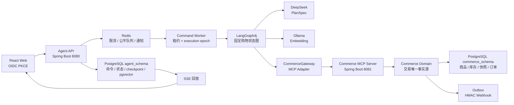
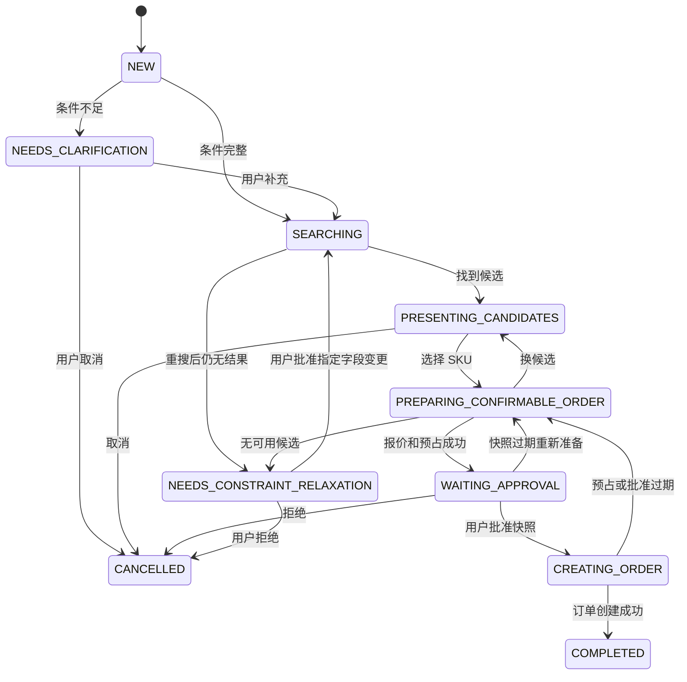
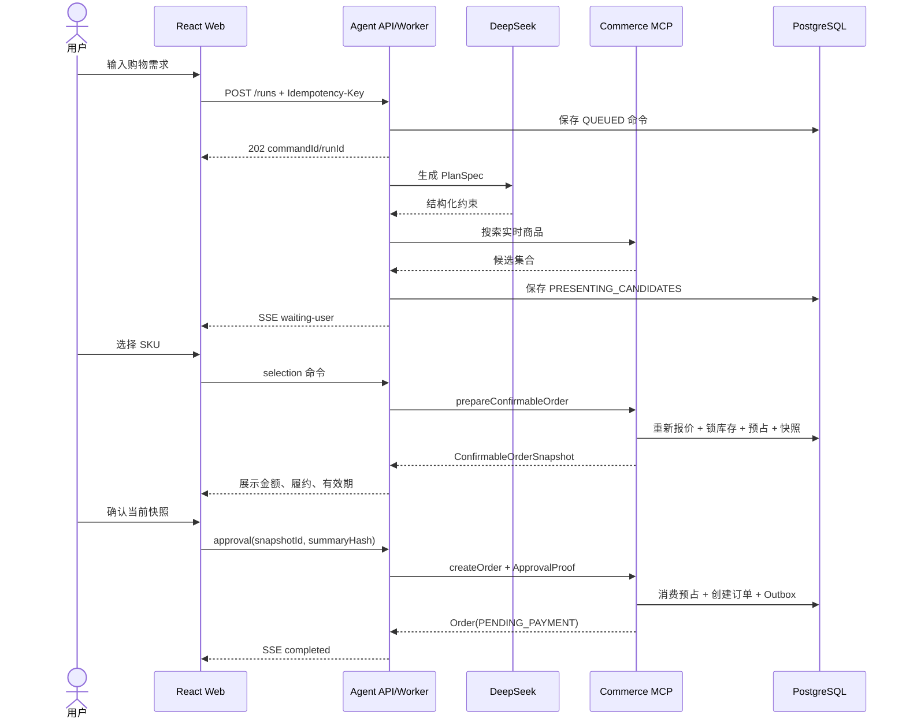

# BuyForU 电商购物 Agent 项目设计与面试指南

> 文档基线：`fix/correctness-and-acceptance` 分支，核心代码提交 `cc96970`  
> 文档日期：2026-08-13  
> 项目定位：可运行、可恢复、交易边界明确的 Java 电商购物 Agent；不是完整支付与履约平台。

## 1. 项目状态结论

BuyForU 已经完成从自然语言购物需求到候选推荐、库存预占、人工确认和订单创建的真实业务闭环。它不是用固定返回值拼出的演示页面：规划通过 DeepSeek 完成，知识检索使用 Ollama Embedding 与 pgvector，Agent 与 Commerce 通过 MCP 通信，交易数据落在 PostgreSQL，入口协调和公平队列使用 Redis。

当前适合用于：

- 本地完整运行和代码演示。
- Java 后端、Agent 工程化、交易一致性或高并发方向的项目面试。
- 继续扩展真实商品、支付、履约或知识运营能力的基础工程。

当前不应宣称：

- 已实现支付、退款、物流和售后全链路。
- 已经过真实生产流量和容灾演练。
- 已达到金融级 exactly-once 或跨地域多活标准。

### 1.1 本次核验结果

| 项目 | 结果 | 说明 |
| --- | --- | --- |
| Java 21 编译及单元测试 | 通过 | `./mvnw -B clean test`，21 个测试全部通过 |
| 前端 TypeScript 检查 | 通过 | `npm run typecheck` |
| 前端生产构建 | 通过 | `npm run build`，80 个模块完成构建 |
| Testcontainers 集成测试 | 本轮未运行 | 当前 Docker daemon 未启动；仓库内有 6 个 PostgreSQL/pgvector 集成场景 |
| DeepSeek、MCP、Ollama 全链路 | 本轮未重新调用 | 需要本地基础设施、模型和 API Key；项目不提供规则模型降级 |

因此，项目当前状态可以概括为：**核心设计和代码闭环已经成立，基础构建通过；外部依赖联调与容器集成测试需要在 Docker 和 DeepSeek 可用时再执行一次最终验收。**

## 2. 业务目标与范围

### 2.1 核心用户故事

1. 用户登录后登记可履约配送区域。
2. 用户输入自然语言购物需求，例如预算、品类、品牌、规格和送达时间。
3. Agent 将需求转换为受约束的 `PlanSpec`。
4. 条件不足时，Agent 暂停并要求用户补充，而不是自行猜测。
5. Commerce 根据实时商品、价格、优惠、库存和配送能力返回候选。
6. 用户选择候选 SKU 后，Commerce 重新报价并预占库存。
7. 页面展示不可篡改的 `ConfirmableOrderSnapshot`。
8. 用户明确批准当前快照后，Commerce 幂等创建订单。
9. 用户拒绝、取消或快照过期时，系统释放库存或重新生成快照。
10. 当前硬约束没有结果时，系统先换候选、再重新搜索，最后才请求用户明确批准放宽指定条件。

### 2.2 本阶段不做的业务

- 支付渠道和支付回调。
- 物流履约、发货、签收和售后。
- 多商家拆单、购物车合并、复杂优惠叠加。
- Elasticsearch 商品检索、推荐训练和用户画像平台。
- 动态生成任意 Agent DAG。

这些能力不影响当前项目证明“Agent 如何安全进入交易系统”这一核心价值。

## 3. 设计原则

### 3.1 Agent 负责决策辅助，Commerce 负责交易事实

Agent 可以：

- 理解自然语言。
- 生成受限计划。
- 检索知识和商品。
- 排序候选。
- 控制澄清、重搜、选择和审批流程。

Agent 不可以：

- 自行计算最终应付金额。
- 自行声明库存可用。
- 修改库存表。
- 绕过用户审批创建订单。
- 用历史价格冒充实时价格。

金额、优惠、运费、库存、履约和订单只以 Commerce 返回的数据为准。

### 3.2 固定状态图，LLM 只生成数据

LLM 输出 `PlanSpec`，不输出可执行代码或任意 DAG。状态图由 `FixedShoppingGraph` 固定，写操作节点和人工确认点不能由模型删除、绕过或重新排序。

### 3.3 PostgreSQL 是事实来源，Redis 是协调层

PostgreSQL 保存：

- Agent 命令和状态。
- Run 租约与 execution epoch。
- SSE 事件。
- LangGraph checkpoint。
- 商品、库存、预占、快照和订单。
- effect ledger 和 Outbox。

Redis 只保存：

- Token Bucket 限流状态。
- 公平调度索引。
- 用户执行许可。
- SSE 跨实例唤醒通知。

Redis 数据丢失不会丢订单或任务，后台会从 PostgreSQL 重建最多 2000 条有界待执行命令的索引。

### 3.4 网络调用不能占用数据库事务

DeepSeek、Ollama、MCP 和 Webhook 调用前必须结束数据库事务。网络适配器通过 `NetworkCallGuard` 检查当前线程是否处于事务中，违规调用立即失败。

## 4. 总体架构



### 4.1 模块划分

| 模块 | 运行端口 | 核心职责 | 主要依赖 |
| --- | ---: | --- | --- |
| `commerce-port` | 无 | `CommerceGateway` 和跨服务交易模型 | 纯 Java |
| `commerce-service` | 8081 | 权威计价、库存预占、快照、订单、MCP Server | Spring Boot、JDBC、Flyway、PostgreSQL、Spring AI MCP |
| `agent-app` | 8080 | JWT API、异步命令、固定图、DeepSeek、RAG、MCP Client、SSE | Spring AI、LangGraph4j、Redis、Resilience4j、pgvector |
| `web` | 5173 | OIDC 登录、需求输入、候选选择、审批和进度展示 | React、TypeScript、TanStack Query、oidc-client-ts |
| `infra/keycloak` | 8082 | 本地 OIDC Realm、Client、角色和 audience | Keycloak |

### 4.2 技术栈基线

| 技术 | 版本/配置 | 用途 |
| --- | --- | --- |
| Java | 21 | records、虚拟线程、现代并发能力 |
| Spring Boot | 4.1.0 | Agent 与 Commerce 服务基础框架 |
| Spring AI | 2.0.0 | DeepSeek OpenAI 兼容调用、Ollama、MCP |
| LangGraph4j | 1.8.24 | 固定状态图和 checkpoint |
| MCP SDK | 2.0.0 | Agent 与 Commerce 的结构化 Tool 协议 |
| Resilience4j | 2.3.0 | Bulkhead、CircuitBreaker |
| PostgreSQL | 17 + pgvector | 关系事务、JSONB、行锁、checkpoint、向量检索 |
| Redis | 7.4 | 限流、公平队列、执行许可和实时通知 |
| Keycloak | 26.3 | OIDC Authorization Code + PKCE |
| React | 19 | Web UI |
| TypeScript | 5.9 | 前端类型约束 |
| Vite | 7 | 前端开发与构建 |

## 5. 领域边界

### 5.1 CommerceGateway

`commerce-port` 定义 Agent 能接触的全部交易能力：

```java
listAddresses(userId)
searchProducts(request)
quote(request)
registerAddress(command, effectContext)
prepareConfirmableOrder(request, effectContext)
releaseReservation(reservationId, effectContext)
createOrder(command, effectContext)
```

接口中没有 MCP、HTTP、JDBC 或 Spring 类型。MCP 只是 Adapter，将来改成 HTTP/RPC 时，Agent 应用层和 Commerce 领域契约可以保持不变。

### 5.2 核心交易模型

| 模型 | 含义 |
| --- | --- |
| `Money` | 当前只支持非负 CNY，最多两位小数 |
| `ProductCandidate` | 当前可展示的商品候选，不代表最终交易承诺 |
| `Quote` | 权威报价，包含商品小计、优惠、运费、应付、履约和有效期 |
| `Reservation` | 库存预占，状态为 ACTIVE/CONSUMED/RELEASED/EXPIRED |
| `ConfirmableOrderSnapshot` | 绑定用户、地址、报价、履约、预占和有效期的确认快照 |
| `ApprovalProof` | 用户对特定 snapshotId 与 summaryHash 的批准证明 |
| `Order` | 从唯一来源快照创建的订单，当前创建后状态为 PENDING_PAYMENT |
| `EffectContext` | 写操作的 effectId、幂等键、run、节点、用户和 trace 上下文 |

## 6. Agent 规划设计

### 6.1 PlanSpec

DeepSeek 只能生成以下类型的数据：

- `intentType`：发现、比较或购买。
- `normalizedConstraints`：查询、品类、预算、品牌、规格、数量、地址和送达日期。
- `clarification`：是否缺少信息、缺少哪些字段、应该问什么。
- `searchStrategy`：搜索策略元数据。
- `readTasks`：允许的只读任务枚举。
- `rankingPreferences`：价格、履约、规格、品牌排序偏好。
- `fallbackPolicy`：候选回退、最多两次 Search Replan、约束变更必须确认。

其中 `intentType`、`searchStrategy` 和部分 `readTasks` 当前主要作为受限计划元数据，不会动态改变固定图拓扑。

### 6.2 双重校验

1. Spring AI 结构化输出保证 JSON 形状符合 `PlanSpec`。
2. `PlanSpecValidator` 执行业务校验：
   - 不允许重复或未知任务。
   - 品牌不能同时属于偏好和排除列表。
   - 数量必须在 1 到 99 之间。
   - 缺少品类或地址必须澄清。
   - Search Replan 最多两次。
   - 约束放宽必须人工确认。

应用还会把 API 提供的可信地址和显式约束重新合并，模型不能覆盖经过认证的地址。

### 6.3 不提供隐藏降级模型

DeepSeek 不可用时，命令进入重试等待或失败，不会用本地规则模型伪造一个看似合理的 PlanSpec。这样可以避免测试实现误入生产，也让故障状态对用户和运维可见。

## 7. 固定状态图



人工等待节点使用 LangGraph4j `interruptAfter`：

- `needClarification`
- `presentCandidates`
- `awaitApproval`
- `constraintRelaxation`

客户端只能提交对应命令恢复当前中断点，不能直接指定目标 phase。

## 8. 三种状态及恢复职责

### 8.1 ShoppingAgentState

回答“业务现在是什么结果”，包含候选、选中项、快照、待审批、活动副作用和最终订单。页面以它为准。

### 8.2 LangGraph checkpoint

回答“图从哪个节点继续”，保存 thread、checkpoint、当前节点、下一节点和图状态。

### 8.3 Effect ledger

回答“外部副作用是否已经发生”。即使 Commerce 已经成功预占或下单，但 Agent 在保存新状态前崩溃，恢复后使用同一 effectId 可以取得首次结果，而不是重复执行。

三者分别解决业务展示、流程恢复和副作用幂等，不能互相替代。

## 9. 完整购物流程



### 9.1 三级 Replan

1. **Candidate fallback**：当前候选缺货时，尝试下一个已验证候选。
2. **Search replan**：硬约束不变，只调整搜索表达或策略，最多两次。
3. **Constraint relaxation**：仍无结果时暂停，用户必须点名允许改变的字段。

地址不能通过约束放宽修改，避免模型把交易发送到未经认证的地址。

## 10. Commerce 交易一致性

### 10.1 权威计价

应付金额公式为：

```text
payable = unitPrice × quantity - discount + shippingFee
```

预算 `budgetMax` 约束的是最终应付金额，而不是商品吊牌价。搜索阶段使用相同规则进行筛选；生成快照时再次读取当前价格、促销和运费，在扣减库存前做最终预算校验。

### 10.2 库存预占

`prepareConfirmableOrder` 在一个 Commerce 数据库事务中完成：

1. 校验 effect 所属用户。
2. 根据用户、SKU、数量、地址和预算计算 requestHash。
3. 通过 effect ledger 处理重放或冲突。
4. 回收当前 SKU 已过期的预占。
5. 使用 `SELECT ... FOR UPDATE` 锁定库存行。
6. 校验可售库存。
7. 生成权威报价并检查总应付预算。
8. 扣减可售数量。
9. 创建 15 分钟库存预占。
10. 生成快照和 summaryHash。
11. 保存快照并完成 effect。

报价自身有效期为 5 分钟，最终快照有效期取报价和预占有效期中的更早值。

### 10.3 人工确认

用户批准时提交：

```text
snapshotId + expectedSummaryHash
```

Commerce 再次验证：

- snapshot 属于当前用户。
- approval.approvedBy 是当前用户。
- snapshotId 和 summaryHash 完全匹配。
- 批准时间合法且未过期。
- 预占仍为 ACTIVE。
- 当前快照尚未创建订单。

### 10.4 防止重复订单

系统有三层保护：

1. `effect_record` 对 effectId 和网络幂等键去重。
2. `orders.source_snapshot_id` 唯一，一个快照只能生成一个订单。
3. `orders.reservation_id` 唯一，一个预占只能被一个订单消费。

因此，即使响应丢失、Worker 重启或同一审批被重复提交，也只会得到首次订单结果。

### 10.5 Outbox

订单和 `ORDER_CREATED` 事件在同一数据库事务写入。后台任务：

1. 在短事务中将一条 PENDING 事件标为 CLAIMED。
2. 提交事务并归还数据库连接。
3. 在事务外发送 HMAC-SHA256 Webhook。
4. 使用 `claimed_by` 条件更新为 PUBLISHED 或重新排队。
5. 最多尝试 10 次，指数退避上限 300 秒。

Webhook 连接超时 3 秒、读取超时 10 秒。投递语义是 at-least-once，接收方应按 `X-BuyForU-Event-Id` 去重。

## 11. 异步命令模型

### 11.1 为什么写接口返回 202

DeepSeek 和 MCP 延迟明显高于普通数据库请求。同步等待会占用 HTTP 线程、难以公平调度，也无法在进程重启后恢复。因此所有 Run 写操作持久化为 `agent_command`，立即返回：

```json
{
  "commandId": "UUID",
  "runId": "UUID",
  "status": "QUEUED",
  "queueClass": "PLANNING",
  "acceptedAt": "2026-08-13T08:00:00Z",
  "deadlineAt": "2026-08-13T08:03:30Z",
  "eventUrl": "/api/v1/runs/{runId}/events",
  "statusUrl": "/api/v1/commands/{commandId}"
}
```

### 11.2 命令分类

| 队列 | 命令 | 默认 Worker | 队列容量 | 总期限 |
| --- | --- | ---: | ---: | ---: |
| PLANNING | START、CLARIFY、RELAX | 20 | 1500 | 210 秒 |
| TRANSACTION | SELECT、APPROVE | 16 | 500 | 50 秒 |
| CONTROL | REJECT、CANCEL | 4 | PostgreSQL 控制路径 | 15 秒 |

### 11.3 命令状态

```text
QUEUED -> RUNNING -> WAITING_USER / SUCCEEDED / CANCELLED
                    RETRY_WAIT -> RUNNING
                    FAILED / EXPIRED
```

命令状态和业务 phase 是两个概念：命令可以完成为 `WAITING_USER`，而 Run 处于 `PRESENTING_CANDIDATES` 或 `WAITING_APPROVAL`。

### 11.4 API 幂等

- 所有 Run 写接口要求 `Idempotency-Key`。
- 唯一作用域为 `(userId, runId, idempotencyKey)`。
- 相同 key 和相同请求摘要返回原命令。
- 相同 key 但请求内容不同返回 409。
- START 的 runId 由 `userId + idempotencyKey` 确定生成。
- 副作用幂等与 API 命令幂等彼此独立。

## 12. 入口限流与公平队列

### 12.1 Redis Token Bucket

Lua 在一次原子操作中完成令牌补充、判断和扣减。默认限制：

| 维度 | 默认值 |
| --- | ---: |
| PLANNING 用户 | 6 次/分钟，突发 2 |
| TRANSACTION 用户 | 30 次/分钟，突发 10 |
| CONTROL 用户 | 30 次/分钟，突发 10 |
| GET 用户 | 120 次/分钟，突发 30 |
| 写入口全局 | 100 次/秒，突发 200 |
| 单用户排队 | 最多 10 条 |

PLANNING/TRANSACTION 在 Redis 不可用时 fail-closed；查询 fail-open；取消走 PostgreSQL 控制路径。

### 12.2 用户级公平调度

Redis 使用：

- 每用户 LIST：保证用户内部 FIFO。
- active-users ZSET：记录用户虚拟完成时间。
- indexed SET：命令入队去重。
- depth 计数：控制总容量。

每次选择虚拟完成时间最小的用户，只取该用户一条命令，再将其虚拟时间加一。这是用户等权轮转，而不是所有命令全局 FIFO，因此高频用户不能让偶发用户长期等待。

同一用户还有一个 240 秒执行许可，正常完成时通过 compare-and-delete Lua 原子释放。获取失败的命令放回用户队头，不破坏用户 FIFO。

## 13. Run 租约、栅栏与数据库连接

### 13.1 短事务 claim

Worker 执行命令前：

1. 锁定 `agent_run_execution`。
2. 确认没有未过期 active command。
3. execution epoch 加一。
4. 写入 active command、owner 和 30 秒租约。
5. 命令改为 RUNNING，attempts 加一。
6. 读取当前 state version。
7. 提交事务。

随后才执行 LangGraph、DeepSeek、Ollama 和 MCP。

### 13.2 heartbeat 与恢复

- 每 10 秒使用独立调度线程续租。
- 进程死亡后租约不再更新。
- 恢复器每 5 秒处理过期租约。
- 命令最多恢复 3 次，且不能超过 deadline。

### 13.3 execution epoch + state version

保存 Agent 状态必须同时匹配：

```text
runId
activeCommandId
executionEpoch
expectedStateVersion
leaseUntil > now
```

租约过期后，即使旧 Worker 从暂停中恢复，其 epoch 已落后，数据库更新数为 0，系统抛出 stale execution，不允许覆盖新 Worker 的结果。LangGraph checkpoint 同样校验 execution epoch。

### 13.4 为什么 LLM 并发不等于数据库连接数

Agent Hikari 默认最大 12 个连接。20 路 DeepSeek 调用并不要求 20 个数据库连接，因为：

- claim 是短事务。
- 状态读取后 ResultSet 已关闭。
- LLM/MCP 在事务外运行。
- 保存状态时再临时申请连接。

这避免慢网络把连接池耗尽。

## 14. 线程池、超时与熔断

Java 21 虚拟线程降低阻塞式 SDK 的线程成本，但虚拟线程不代表资源无限。系统仍为每类依赖设置独立 Bulkhead：

| 依赖 | 默认并发 | 单次调用超时 |
| --- | ---: | ---: |
| DeepSeek | 20 | 45 秒 |
| MCP Read | 32 | 3 秒 |
| MCP Write | 16 | 5 秒 |
| Ollama Embedding | 8 | 10 秒 |

执行器使用零等待 Bulkhead，资源满时不在依赖内部继续堆积，等待留在可观察、可恢复的命令队列。

熔断统计排除明确的 Commerce 业务异常，例如库存不足和快照过期；网络错误、超时和基础设施故障才计入熔断器。所有调用还会受到 command deadline 限制，不能在每一层重新获得完整超时预算。

## 15. 取消语义

取消命令独立于 Redis 公平队列：

- 先在 PostgreSQL 设置 `cancel_requested`。
- heartbeat 发现后取消当前下游 Future，并中断 Worker。
- 在下一个安全点终止流程。
- 已预占但未下单时幂等释放库存。
- 已经创建订单时，Agent 不会伪造回滚，而是返回领域冲突。

## 16. RAG 与记忆

### 16.1 会话记忆

`JdbcConversationMemory` 保存 conversation owner 和用户消息。规划时读取最近 8 条用户消息构建上下文。不同用户不能读取或追加同一 conversation。

### 16.2 知识入库

`knowledge-admin` 调用 `/internal/v1/knowledge/documents`：

1. 校验文档、来源 URI、版本和 expectedVersion。
2. 在事务外调用 Ollama 生成 embedding。
3. 使用最多 1200 字符的段落优先切块。
4. 在短事务中写文档、chunks 和审计摘要。
5. 更新时使用 expectedVersion 防止并发覆盖。

同一语料库禁止混用不同 Embedding 模型或维数。

### 16.3 检索

规划前对用户请求生成向量，使用 cosine distance 从 pgvector 召回最多 5 条、最低分数 0.65 的知识片段。检索内容在 Prompt 中被标记为“不可信证据”，不能覆盖 system rules 或可信约束。

当前 Golden Set 只用于固定评估数据格式，尚未形成完整 Recall@K/MRR 自动评估；这是后续质量工程，不影响主购物交易链路运行。

## 17. MCP 设计

Commerce MCP Server 暴露 7 个结构化工具：

| Tool | 类型 | 说明 |
| --- | --- | --- |
| `commerce_address_list` | 读 | 当前用户地址 |
| `commerce_catalog_search` | 读 | 按显式约束搜索商品 |
| `commerce_quote_calculate` | 读 | 计算权威报价，不预占 |
| `commerce_address_register` | 写 | 幂等登记配送区域 |
| `commerce_confirmable_order_prepare` | 写 | 报价、预占并生成快照 |
| `commerce_inventory_release` | 写 | 幂等释放预占 |
| `commerce_order_create` | 写 | 使用审批证明创建订单 |

MCP Tool 自动回调对 LLM 关闭。也就是说，DeepSeek 不能自行决定调用写 Tool；只有固定图的 Java 节点可以通过 `CommerceGateway` 发起交易调用。

Agent 到 Commerce 使用至少 32 字符的 `X-BuyForU-Service-Token`，Commerce 使用常量时间比较验证令牌。

## 18. SSE 与前端恢复

运行事件先写入 `agent_run_event`，再通过 Redis Pub/Sub 唤醒当前实例上的 SSE 连接。

支持事件：

- `command.accepted`
- `command.started`
- `run.waiting-user`
- `command.retry-wait`
- `command.completed`
- `command.failed`
- `command.cancelled`
- `heartbeat`

浏览器使用 `fetch + ReadableStream`，因为原生 EventSource 不便安全附加 Bearer Token。断线重连时发送 `Last-Event-ID`；服务端从 PostgreSQL 回放缺失事件。实时流失败后前端退回命令状态轮询。

页面刷新后重新读取当前用户的地址和最近 20 个 Run，因此人工等待状态不会只存在浏览器内存中。

## 19. 数据模型

### 19.1 agent_schema

| 表 | 作用 |
| --- | --- |
| `conversation` | 会话及所属用户 |
| `message` | 用户消息记忆 |
| `agent_run` | 当前 ShoppingAgentState 与 state_version |
| `agent_checkpoint` | 业务状态历史 |
| `langgraph_checkpoint` | LangGraph 节点位置和 execution_epoch |
| `approval_request` | 人工审批、决定和操作者审计 |
| `tool_call` | MCP Tool 调用摘要 |
| `knowledge_document` | 知识文档、版本、模型和维数 |
| `knowledge_chunk` | 文档切块与 pgvector embedding |
| `knowledge_audit` | 知识变更操作者和正文摘要 |
| `agent_command` | 持久化异步命令 |
| `agent_run_execution` | Run 租约、epoch 和取消标记 |
| `agent_run_event` | SSE 可回放事件 |

### 19.2 commerce_schema

| 表 | 作用 |
| --- | --- |
| `product` | SPU 基础信息和 JSONB 属性 |
| `sku` | SKU、状态、单价和价格版本 |
| `inventory` | 可售库存和版本 |
| `inventory_reservation` | 库存预占及有效期 |
| `confirmable_snapshot` | 用户可确认快照 |
| `orders` | 订单和唯一来源快照 |
| `effect_record` | 副作用幂等账本 |
| `outbox_event` | 订单领域事件 |
| `delivery_zone` | 配送区域和时效 |
| `customer_address` | 用户登记的配送区域 |
| `promotion_rule` | 满减规则 |
| `shipping_rule` | 包邮门槛和标准运费 |

数据库只通过 Flyway 增量迁移。已经执行的历史迁移不能回改，否则 Flyway checksum 会阻止启动。

## 20. HTTP API

### 20.1 用户 API

| 方法 | 路径 | 作用 | 返回 |
| --- | --- | --- | --- |
| POST | `/api/v1/addresses` | 登记配送区域 | 地址 |
| GET | `/api/v1/addresses` | 查询当前用户地址 | 地址列表 |
| POST | `/api/v1/runs` | 创建购物任务 | 202 CommandAccepted |
| GET | `/api/v1/runs` | 最近 20 个任务 | Run 列表 |
| GET | `/api/v1/runs/{runId}` | 查询任务业务状态 | ShoppingAgentState |
| POST | `/api/v1/runs/{runId}/clarifications` | 补充信息 | 202 CommandAccepted |
| POST | `/api/v1/runs/{runId}/selection` | 选择 SKU | 202 CommandAccepted |
| POST | `/api/v1/runs/{runId}/approvals` | 批准或拒绝快照 | 202 CommandAccepted |
| POST | `/api/v1/runs/{runId}/constraint-relaxations` | 批准指定约束变更 | 202 CommandAccepted |
| POST | `/api/v1/runs/{runId}/cancellations` | 取消任务 | 202 CommandAccepted |
| GET | `/api/v1/commands/{commandId}` | 查询命令状态 | CommandView |
| GET | `/api/v1/runs/{runId}/events` | SSE 进度与断点回放 | text/event-stream |

除 GET 外的 Run 写接口都要求 `Idempotency-Key` 请求头。用户身份只从 JWT `sub` 获取。

### 20.2 管理 API

| 方法 | 路径 | 权限 | 作用 |
| --- | --- | --- | --- |
| POST | `/internal/v1/knowledge/documents` | `knowledge-admin` | 知识文档入库或版本更新 |

## 21. 安全设计

### 21.1 用户认证

- Web 使用 OIDC Authorization Code + PKCE。
- Agent 是无状态 OAuth2 Resource Server。
- 同时校验 JWT issuer 和 audience。
- realm roles 映射为 `ROLE_*`。
- 用户 ID 只取 JWT `sub`。
- 非 START 命令在落库前校验 Run owner。
- SSE 和命令查询也校验所属用户。

### 21.2 数据最小化

- 命令状态 API 不返回 payload、请求哈希和幂等键。
- Tool 审计保存请求/响应摘要，不复制完整交易输入。
- 知识审计保存正文 SHA-256，不复制正文。
- API Key、JWT 和服务令牌不写数据库或日志。
- 当前地址模型只保存配送区域，不保存完整敏感地址。

## 22. 配置与本地启动

### 22.1 必需环境

- JDK 21。
- Node.js 20+。
- Docker Desktop。
- DeepSeek API Key。

### 22.2 必填配置

从模板创建本地文件：

```bash
cp .env.example .env
cp web/.env.example web/.env
```

根目录 `.env` 至少配置：

```dotenv
DEEPSEEK_API_KEY=your-key
KEYCLOAK_ADMIN_USERNAME=your-admin
KEYCLOAK_ADMIN_PASSWORD=your-password
COMMERCE_MCP_SERVICE_TOKEN=a-random-string-at-least-32-characters
```

不要提交 `.env` 或真实密钥。

### 22.3 启动顺序

```bash
docker compose --env-file .env up -d
docker compose ps
```

Docker Compose 只启动 PostgreSQL、Redis、Keycloak、Ollama 和模型初始化，不启动 Java/Web 应用。

在 IDEA 中启动：

1. `com.buyforu.commerce.CommerceServiceApplication`
2. `com.buyforu.agent.BuyForUAgentApplication`
3. 在 `web` 目录执行 `npm run dev`

命令行启动：

```bash
set -a; source .env; set +a
./mvnw -pl commerce-port,commerce-service,agent-app -am install -DskipTests
./mvnw -pl commerce-service spring-boot:run
./mvnw -pl agent-app spring-boot:run
cd web && npm install && npm run dev
```

## 23. 测试、CI 与可观测性

### 23.1 测试分层

单元测试覆盖：

- Commerce 写操作幂等和 effect 冲突。
- 预算按最终应付校验。
- 并发预占不超卖。
- 固定图拓扑和人工中断恢复。
- 完整选择、快照、批准和下单。
- 事务内网络调用保护。
- Future 取消。
- PlanSpec 安全校验。
- pgvector 切块边界和评估数据格式。

Testcontainers 集成测试覆盖：

- PostgreSQL 多 Worker 竞争同一个 Run 租约。
- 过期租约恢复后 epoch 递增。
- 跨用户 Run ownership。
- 快照预算校验和库存不误扣。
- Outbox Webhook 在事务外发送。

### 23.2 验收命令

```bash
./mvnw clean test
./mvnw -Pintegration verify
cd web && npm run typecheck && npm run build
```

也可使用：

```bash
./scripts/accept.sh
```

### 23.3 指标

当前自定义指标包括：

- `buyforu_admission_total`
- `buyforu_rate_limit_rejected_total`
- `buyforu_queue_depth`
- `buyforu_queue_wait_seconds`
- `buyforu_command_started_total`
- `buyforu_command_execution_seconds`
- `buyforu_lease_recovered_total`
- `buyforu_fenced_write_rejected_total`
- `buyforu_dependency_active`
- `buyforu_circuit_state`
- `buyforu_sse_connections`
- `buyforu_sse_delivery_failures_total`

Actuator 暴露 health、info 和 Prometheus。

## 24. 故障行为

| 故障 | 系统行为 |
| --- | --- |
| DeepSeek 超时或熔断 | 命令进入 RETRY_WAIT；期限或次数耗尽后 FAILED |
| MCP Read 故障 | 不使用历史价格伪装实时结果，命令重试或失败 |
| MCP Write 响应丢失 | 使用同一 effectId 重试并返回首次结果 |
| Redis 不可用 | 新规划/交易命令 503；查询可用；取消走 PostgreSQL |
| Worker 进程退出 | 30 秒租约到期后恢复，epoch 拒绝旧 Worker 写入 |
| SSE 中断 | Last-Event-ID 回放；失败后轮询命令状态 |
| 快照过期 | 释放或回收旧预占，重新报价并生成新快照 |
| 下单成功后 Agent 崩溃 | source_snapshot 唯一 + effect ledger 防止重复订单 |
| Webhook 失败 | Outbox 指数退避，最多 10 次 |

## 25. 关键取舍

### 25.1 为什么使用 PostgreSQL，而不是 MySQL

项目同时需要关系事务、行锁、advisory lock、JSONB、sequence 和 pgvector。PostgreSQL 可以同时承载交易数据、Agent checkpoint 和向量知识，减少当前规模下的中间件数量。

如果公司已有 MySQL 交易平台，可以让 Commerce 使用 MySQL，而 Agent checkpoint/RAG 继续使用 PostgreSQL；`CommerceGateway` 已经隔离了持久化差异。

### 25.2 为什么不用动态 DAG

动态 DAG 灵活，但会扩大模型权限和恢复状态空间。购物下单属于高风险副作用场景，固定图更容易审计、测试和证明“审批节点不可绕过”。

### 25.3 为什么需要 MCP Adapter

MCP 提供标准化 Tool Schema 和模型生态兼容性，但业务层不应该依赖协议。把 MCP 放在 Adapter 层既能展示 MCP 工程能力，又不会让领域模型绑定具体传输技术。

### 25.4 为什么使用虚拟线程还需要 Bulkhead

虚拟线程解决线程成本，不解决 DeepSeek 配额、MCP 连接数和数据库容量。Bulkhead 控制的是稀缺外部资源，并将积压留在可恢复命令队列中。

### 25.5 为什么 Redis 不能保存命令事实

Redis 队列擅长协调，但任务状态、审计和交易结果必须可靠恢复。PostgreSQL 作为事实来源后，Redis 丢失只影响短暂调度效率，不会丢业务。

## 26. 当前边界与后续路线

### 26.1 当前可接受边界

- 商品量较小，搜索仍使用 PostgreSQL LIKE、JSONB 与 Java 侧少量过滤。
- pgvector 尚未增加 HNSW/IVFFlat，适合当前小语料。
- RAG Golden Set 还是评估骨架，没有完整召回指标流水线。
- Docker Compose 只负责基础设施，应用由 IDEA 或命令启动。
- 订单创建后停留在 PENDING_PAYMENT。
- 部分 PlanSpec 字段作为解释性元数据，不驱动动态节点。

### 26.2 推荐后续顺序

1. 在 Docker 正常环境执行 `./mvnw -Pintegration verify`。
2. 使用真实 DeepSeek、Ollama、Keycloak 和 MCP 完成一次端到端录屏验收。
3. 增加真实 RAG 语料和 Recall@K 测试。
4. 数据量增长后再优化商品检索和 pgvector 索引。
5. 只有业务需要时再接支付和履约，不继续添加无使用场景的 Agent 组件。

---

# 面试问答

## 27. 项目介绍类

### Q1：请用一分钟介绍 BuyForU

**参考答案：**

BuyForU 是一个 Java 电商购物 Agent。用户输入自然语言需求，DeepSeek 只生成受限的 PlanSpec，LangGraph4j 固定图负责澄清、搜索、候选选择、库存预占、人工审批和下单。金额、优惠、库存和订单全部由独立 Commerce Domain 决定，Agent 通过 CommerceGateway 的 MCP Adapter 调用。写请求使用 PostgreSQL 持久化命令和 Redis 公平队列异步执行，Run 用租约、execution epoch 和 state version 防止多 Worker 并发覆盖。最终下单还有 effect ledger、快照唯一订单和 Outbox，解决重复副作用与崩溃恢复。

### Q2：这个项目和普通 ChatBot 最大区别是什么？

**参考答案：**

普通 ChatBot 主要生成文本；BuyForU 会推进有状态业务流程并触发库存和订单副作用。因此重点不只是 Prompt，而是权限边界、人工确认、幂等、事务、恢复、并发和审计。LLM 不能直接调用交易写 Tool，也不能自行决定最终价格。

### Q3：项目最重要的三个设计是什么？

**参考答案：**

1. 固定 LangGraph 图，LLM 只生成 PlanSpec。
2. Commerce 是交易事实唯一来源，确认前生成带库存预占的快照。
3. PostgreSQL 命令事实 + Redis 公平调度 + Run 租约栅栏，保证网络调用不占数据库连接且任务可恢复。

### Q4：项目现在能做到什么，不能做到什么？

**参考答案：**

能完成登录、地址登记、需求理解、澄清、RAG、商品搜索、选择、权威报价、库存预占、快照确认和幂等创建订单。不能完成真实支付、发货、退款和售后；这些属于订单下游系统，不应该为了展示 Agent 而伪造。

## 28. Agent 与 LangGraph 类

### Q5：为什么不让 LLM 生成任意执行计划？

**参考答案：**

因为模型输出不稳定，任意 DAG 可能绕过审批、重复执行写节点或产生无法恢复的拓扑。项目把图固定在 Java 中，模型只输出约束、澄清、排序和搜索策略数据。这样可以静态审计状态转换，并为每个节点写确定性测试。

### Q6：结构化输出已经有 JSON Schema，为什么还需要 PlanSpecValidator？

**参考答案：**

JSON Schema 主要校验形状，不能完整表达业务语义。例如品牌不能同时偏好和排除、缺地址必须澄清、Search Replan 不能超过两次、约束放宽必须确认。这些属于应用层业务规则，需要第二次校验。

### Q7：为什么不在 DeepSeek 失败时用规则模型降级？

**参考答案：**

隐藏降级会让用户误以为仍然得到相同质量的智能规划，也可能改变约束语义。项目选择显式 RETRY_WAIT/FAILED，让基础设施故障可观察。测试中的确定性模型只用于单元测试，不进入生产 JAR。

### Q8：ShoppingAgentState 和 LangGraph checkpoint 有什么区别？

**参考答案：**

ShoppingAgentState 是业务真相，例如候选、快照和订单；checkpoint 是执行位置，例如当前中断在哪个节点。业务状态用于页面和领域恢复，checkpoint 用于图恢复。二者更新之间如果发生崩溃，GraphShoppingWorkflow 会根据业务 phase 校准图位置。

### Q9：三级 Replan 如何避免偷偷放宽用户约束？

**参考答案：**

候选回退只换已经满足硬约束的候选；Search Replan 只允许改变查询表达并强制保留预算、品牌、数量、地址和送达时间；最后的 Constraint Relaxation 必须暂停，由用户点名允许修改的字段，地址永远不能在该入口修改。

### Q10：RAG 在这个项目里解决什么问题？

**参考答案：**

RAG 提供退换货、活动和库存规则等知识证据，不承担实时价格和库存查询。实时交易事实必须来自 Commerce。检索文本也被标记为不可信证据，防止知识文档中的提示注入覆盖 system rules。

## 29. MCP 与领域边界类

### Q11：为什么 MCP 不是 Commerce 领域接口？

**参考答案：**

MCP 是传输协议。领域层依赖 MCP 会导致模型、SDK 或协议升级影响核心业务。项目先定义纯 Java `CommerceGateway`，MCP Adapter 负责序列化和 Tool 调用。未来换 HTTP/RPC 时只替换 Adapter。

### Q12：为什么关闭 Spring AI 的 Tool 自动回调？

**参考答案：**

如果开启自动回调，LLM 可能自行选择并执行库存预占或下单 Tool。项目只允许固定图的 Java 节点调用写 Tool，因此关闭自动回调，把模型限制在 PlanSpec 生成职责内。

### Q13：MCP Write 超时后为什么不能直接认为失败？

**参考答案：**

超时只能说明调用方没有收到结果，Commerce 可能已经提交事务。直接换新的 effectId 重试会重复预占或下单。因此恢复时必须复用同一 effectId、幂等键和请求摘要，由 effect ledger 返回首次结果。

## 30. 交易一致性类

### Q14：如何保证不会超卖？

**参考答案：**

Commerce 在事务中使用 `SELECT ... FOR UPDATE` 锁住当前 SKU 库存行，检查可售数量后再扣减并创建预占。相同 SKU 的并发预占被串行化，数据库还有 `available_quantity >= 0` 约束作为最后防线。

### Q15：为什么库存预占必须发生在最终确认前？

**参考答案：**

如果确认前不预占，用户看到“可以购买”并点击确认时可能已经缺货；如果过早创建订单又会产生大量无效订单。确认快照同时绑定报价、履约和库存预占，让用户确认的是一个短时间内可兑现的交易条件。

### Q16：summaryHash 防止什么问题？

**参考答案：**

它把用户、地址、SKU、数量、金额、履约、预占和有效期绑定起来。前端批准时必须原样返回 snapshotId 和 hash，Commerce 再次校验，防止确认页面展示 A 条件，真正下单时被替换成 B 条件。

### Q17：如何保证重复点击确认只创建一个订单？

**参考答案：**

API 命令幂等避免重复命令；effect ledger 避免重复副作用；`orders.source_snapshot_id` 唯一保证同一快照只有一个订单；`reservation_id` 唯一保证一个预占只能被消费一次。任何一层发生重试都返回首次结果。

### Q18：下单成功后 Agent 保存状态前崩溃怎么办？

**参考答案：**

订单已经由 Commerce 事务提交，不能回滚。Agent 恢复 CREATING_ORDER 状态后使用相同 effectId 重放 createOrder，Commerce 从 effect ledger 或 source_snapshot 唯一记录返回原订单，然后 Agent 再保存 COMPLETED。

### Q19：为什么订单和 Outbox 必须同事务？

**参考答案：**

如果先提交订单再写事件，进程可能在两者之间崩溃，订单永久没有下游通知；如果先发消息再提交订单，下游可能看到不存在的订单。Transactional Outbox 让订单和待投递事件原子落库，再异步投递。

### Q20：Outbox 是 exactly-once 吗？

**参考答案：**

不是。它是 at-least-once。发送成功但更新 PUBLISHED 前崩溃会导致重复投递，所以接收方必须按 eventId 去重。分布式系统通常用“至少一次 + 幂等消费”获得业务上的恰好一次效果。

## 31. 高并发与恢复类

### Q21：为什么写接口异步化？

**参考答案：**

LLM 和 MCP 延迟高且吞吐受限。异步命令可以快速返回 202、做公平排队、持久化恢复、统一期限和重试，也避免 HTTP 请求线程长期等待。

### Q22：Redis 公平队列如何防止大用户垄断？

**参考答案：**

每个用户内部使用 FIFO LIST，活跃用户放在按虚拟完成时间排序的 ZSET。每次只从最小虚拟时间用户取一条，再把该用户分数加一，因此调度单位是用户轮次，不是全局命令先来先服务。

### Q23：为什么 Redis 只保存索引？

**参考答案：**

Redis 适合高频协调，但命令事实需要审计和崩溃恢复。命令先写 PostgreSQL，Redis 只保存 commandId。Redis 丢失后后台扫描数据库中最多 2000 条有界命令并幂等重建。

### Q24：租约为什么还需要 execution epoch？

**参考答案：**

租约只能判断“现在谁应该执行”，不能阻止旧 Worker 在长时间暂停后恢复。新 Worker 领取时 epoch 加一；所有状态和 checkpoint 写入都校验 epoch。旧 Worker 即使恢复也因 epoch 落后被数据库拒绝。

### Q25：state version 又解决什么问题？

**参考答案：**

epoch 防旧执行器，state version 防同一合法执行上下文基于旧状态覆盖新状态。保存时使用 expected version 做乐观锁，成功后本地 expected version 加一。

### Q26：为什么 LLM 调用期间不能持有数据库连接？

**参考答案：**

LLM 可能等待几十秒。如果每个请求都持有连接，20 路模型调用就可能耗尽连接池，导致查询、心跳和保存状态都失败。项目只在 claim、读取和保存时使用短事务，网络调用前归还连接。

### Q27：虚拟线程是不是意味着不需要线程池隔离？

**参考答案：**

不是。虚拟线程只降低线程阻塞成本，DeepSeek QPS、MCP 连接、Ollama 算力仍有限。项目用独立虚拟线程执行器和 Bulkhead 限制每类依赖并发，避免一个下游故障拖垮其他能力。

### Q28：取消正在执行的 DeepSeek 请求如何实现？

**参考答案：**

控制命令先设置数据库 `cancel_requested`。heartbeat 发现后，从 `InFlightCallRegistry` 找到当前 Future 执行 `cancel(true)`，同时中断外层 Worker。是否能立即停止底层网络还取决于 SDK，但状态写入仍受租约和 epoch 保护。

## 32. 安全与运维类

### Q29：如何防止用户操作别人的 Run？

**参考答案：**

用户 ID 只从已验证 JWT 的 `sub` 获取。非 START 命令在 insert 前校验 `agent_run` 或 START 命令的 owner；命令查询和 SSE 同样校验 owner。客户端提交的 userId 不会被信任。

### Q30：为什么同时校验 issuer 和 audience？

**参考答案：**

issuer 证明 Token 来自可信身份服务，audience 证明 Token 是签发给 BuyForU API 的。只校验签名和 issuer 可能接受同一 Realm 中签给其他客户端的 Token。

### Q31：为什么 Agent 和 Commerce 不共用用户 JWT？

**参考答案：**

Commerce 不是公开用户入口，只接受 Agent 服务调用。内部服务令牌简化了信任边界，真实 userId 仍作为结构化参数并由交易规则验证。生产环境还可以进一步替换为 mTLS 或工作负载身份。

### Q32：Redis 故障为什么查询可用、规划不可用？

**参考答案：**

查询读取 PostgreSQL 权威状态，可以安全 fail-open；新规划和交易命令如果绕过限流与公平队列，可能压垮 DeepSeek和 Commerce，因此 fail-closed。取消属于安全控制操作，优先走 PostgreSQL 保持可用。

### Q33：项目如何观测 stale Worker？

**参考答案：**

状态或 checkpoint 写入因 epoch/version 不匹配时增加 `buyforu_fenced_write_rejected_total`，日志记录 runId/commandId。租约恢复也有 `buyforu_lease_recovered_total`，可以结合队列等待和 Hikari 指标判断实例暂停或容量问题。

## 33. 测试与扩展类

### Q34：你会如何验证“LLM 等待时不占数据库连接”？

**参考答案：**

使用 WireMock 或阻塞式假 DeepSeek Server 启动 20 个 45 秒调用，同时采集 Hikari active connections。claim 完成后活跃连接应回落到基线；网络适配器内的 `NetworkCallGuard` 测试还应证明事务内调用会立即失败。

### Q35：如果商品量从几十条增长到千万条，先改哪里？

**参考答案：**

保持 CommerceGateway 不变，把目录搜索替换为 Elasticsearch/OpenSearch 或专用检索服务；价格、库存和下单仍回 Commerce 权威校验。候选搜索可以最终一致，确认快照必须强一致。

### Q36：如果公司要求 MySQL，项目需要重写吗？

**参考答案：**

不需要重写 Agent。可以替换 Commerce 的 JDBC/Flyway 实现，使用 MySQL 事务和行锁；Agent 的 checkpoint 与 pgvector 继续留在 PostgreSQL。需要重新实现 advisory lock 等 PostgreSQL 特性，但端口和固定图不用改变。

### Q37：下一步最有价值的改进是什么？

**参考答案：**

不是继续增加 Agent 框架，而是完成 Docker 集成测试和一次真实端到端验收；然后补真实知识语料和 RAG Recall@K。只有业务需要时再接支付和履约。

## 34. 面试前必须掌握的代码

建议能够不看文档讲清楚以下文件：

1. `agent-app/.../domain/PlanSpec.java`
2. `agent-app/.../domain/ShoppingAgentState.java`
3. `agent-app/.../application/FixedShoppingGraph.java`
4. `agent-app/.../application/ShoppingWorkflowService.java`
5. `agent-app/.../concurrency/CommandService.java`
6. `agent-app/.../concurrency/CommandWorker.java`
7. `agent-app/.../concurrency/RunLeaseRepository.java`
8. `agent-app/.../concurrency/RedisFairQueue.java`
9. `commerce-port/.../CommerceGateway.java`
10. `commerce-service/.../JdbcCommerceEngine.java`
11. `commerce-service/.../OutboxDispatcher.java`
12. 两个 Schema 的 Flyway 迁移。

面试时不应只背技术名词。至少要能在白板上解释：

- 为什么 LLM 不能拥有交易写权限。
- 从选择商品到创建订单的事务边界。
- 订单成功但 Agent 崩溃时如何恢复。
- Redis 丢失后为什么不会丢任务。
- 租约、epoch、state version 分别解决什么问题。
- 为什么 20 路 LLM 并发不需要 20 个数据库连接。

